# Practical Assignments

## 1. Please complete Practicals 1 to 3, then document the results of your work with a screenshot and explanation!

### Practical 1 : Implementing Control Flows ("if/else)
### Step 1 
- Type or copy the following program code into the function main().
    
    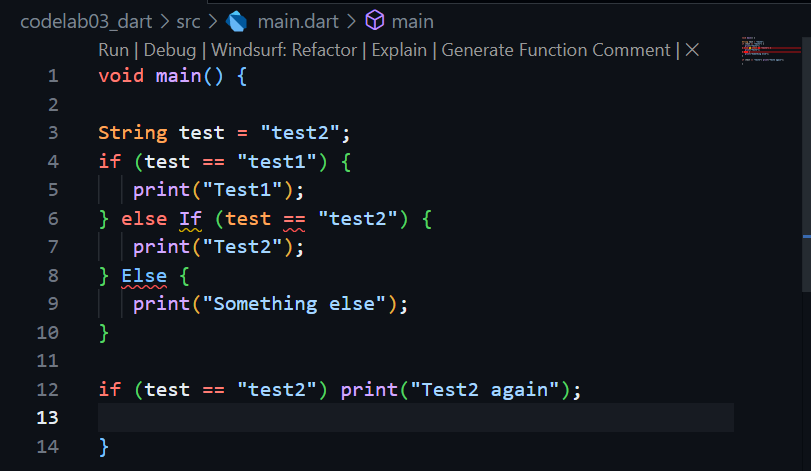

### Step 2
- Please try executing the code in step 1. What happens? Explain!
    
    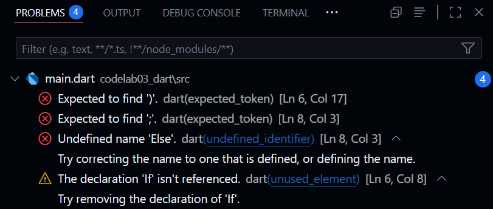

    When the code is executed there are 2 errors because of incorrect  keywords (else If & Else), else if and else must be written in lowerccase. Here's the correct one :

    

### Step 3 
- Add the following program code, then try executing (Run) your code.
    
    

- What happened? If an error occurs, please correct it but continue using if else. There is an error :
    
    
    
    It's because the test variable is a string as the condition, dart doesn't know how to interpret the string "true" as a boolean true automatically. It sees a string and expects a true/false value. This mismatch causes the error. Here's the correct one :
    
    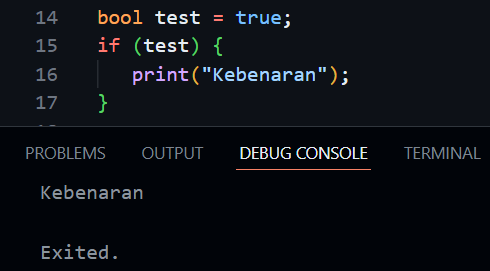

### Practical 2 : Implementing "while" and "do-while" Loops
### Step 1
- Type or copy the following program code into the function main().

    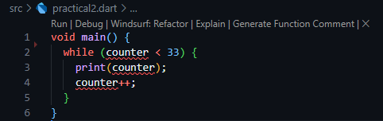

### Step 2
- Please try executing (Run) the code in step 1 above. What happened? Explain! Then fix it if an error occurs.

    
    
    The error occurs because we try to use variable counter without first declaring it or giving it a value. Here's the correct one :

    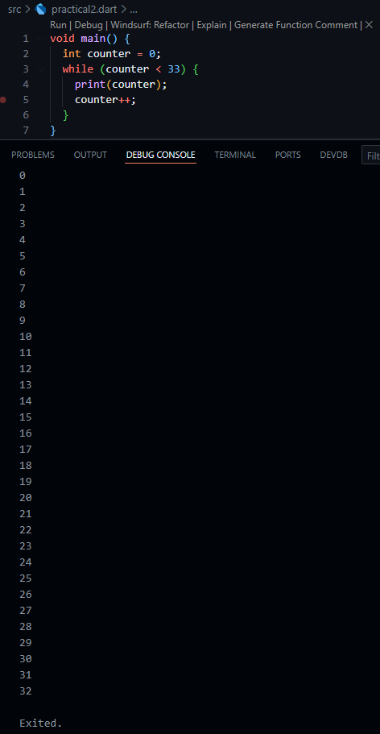

### Step 3
- Add the following program code, then try to execute (Run) your code.

    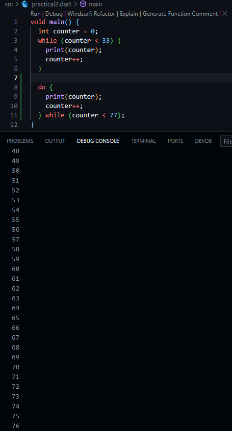

    That code first uses a while loop to print numbers from 0-32, then it uses a do-while loop to print numbers from 33-76,

### Practical 3 : Applying "for" and "break-continue" loops
### Step 1
- Type or copy the following program code into the function main()

    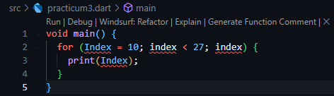

### Step 2
- Please try executing (Run) the code in step 1 above. What happened? Explain! Then fix it if an error occurs.

    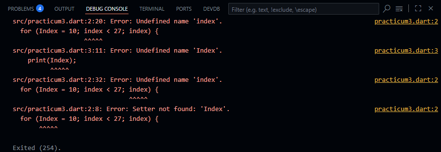

    This error is caused by the absence of a previous variable index declaration, followed by inconsistency in variable names (index & Index). Here's the correct one :

    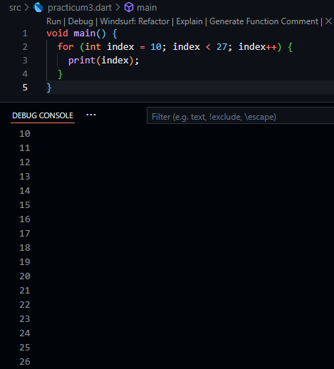

### Step 3
- Add the following program code in the for-loop, then try to execute (Run) your code.

    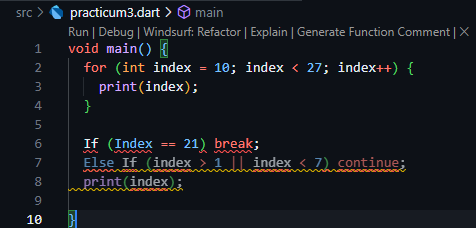

    Here's the correct one :

    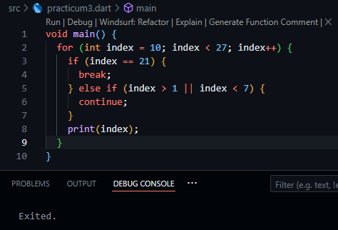

    The code flow :
    1. index starts at 10
    2. 10 < 27 = true
    3. index == 21 = false
    4. index > 1 || index < 7 = true, because 10 > 1
    5. continue; is executed, the print is skipped.
    6. index = 11
    7. The pattern repeats for index values from 10 to 20, for all values, index > 1 is ture so continue is executed and nothing is printed.
    8. When index = 21, index < 27 is true, index == 21 is true, therefore break; is executed.
    
    The print(index); statement will never be reached in this specific code because all values of index from 10 to 20 will trigger the continue statement, and the loop will break when index reaches 21 before print(index) can execute.

## 2. Create a program that displays prime numbers from 0 to 201 using Dart. When a prime number is found, display your full name and student ID number.

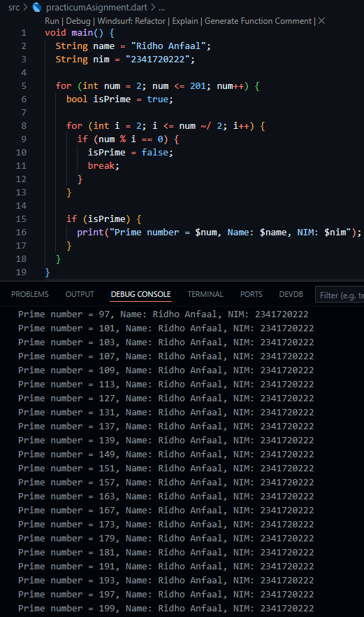

Code flow :
1. Loops through all numbers from 2 to 201
2. isPrime = true; assume it's prime.
3. Check if it can be divided evenly by any smaller number (other than 1).
4. If it can be divided then it's not prime.
5. If it can't be devided then it's prime
6. Whenever the number is prime it will print the number along with my name and student id (nim).