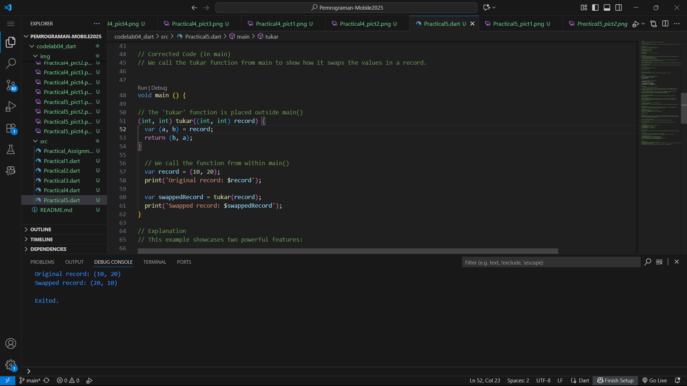

# Report codelab 4

Name    : Yuma Akhunza Kausar Putra
NIM     :2341720259
Absent  :19

## Practical 1

### Step 1
Type or copy the following program code into void main().
````dart:
void main() {
  var list = [1, 2, 3];
  assert(list.length == 3);
  assert(list[1] == 2);
  print(list.length);
  print(list[1]);

  list[1] = 1;
  assert(list[1] == 1);
  print(list[1]);
}
````
Output:


### Step 2:
Please try executing the code in step 1. What happens? Explain!
Answer : This code creates a list with a length of 6, where all elements are null. Even though this list is declared as final, its contents can still be changed.
This code creates a list with a length of 6, where all elements are null. Even though this list is declared as final, its contents can still be changed.

- final means the list variable cannot be reassigned to a completely new list.
- However, the elements inside that list (like list[1], list[2], etc.) are still mutable and can be changed.
This is why we were able to successfully add the name and NIM into the final list without any errors.

### Step 3:
Change the code in step 1 to become a final variable that has index = 5 with default value = null. Fill in your name and NIM in the 1st and 2nd index elements. Then print and capture the results.

```dart:
void main() {
  final list = List.filled(5, null); // List dengan 5 elemen null

  // Isi data
  list[0] = "Yuma Akhunza Kausar Putra";  // ganti dengan nama kamu
  list[1] = "2341720259";          // ganti dengan NIM kamu

  // Cetak hasil
  print(list);
}
```

The code above doesn't work.
This means that when you create a list with List.
filled(5, null), Dart assumes the list is of type List<Null>, 
so it can only hold nulls. When you fill it with "Putra" or "2341720259," 
it immediately throws an error because Strings don't match Null.

Fix code:
```dart:
void main() {
  final List<String?> list = List.filled(5, null); // List dengan 5 elemen null

  // Isi data
  list[0] = "Yuma Akhunza Kausar Putra";  // Nama
  list[1] = "2341720259";          // NIM

  // Cetak hasil
  print(list);
}
```
Output:


You must define a list data type to accommodate strings.
Use List<String?> (a nullable string, meaning it can be either a string or null).

## Practical 2
### Step 1
Type or copy the following program code into the function main().
```dart:
void main() {
  var halogens = {'fluorine', 'chlorine', 'bromine', 'iodine', 'astatine'};
  print(halogens);
}
```
Output:


### Step 2:
Please try running the code in step 1. What happens? Explain! Then, correct any errors.
answer:
1. What happened? The code ran perfectly without any errors. It created a Set named halogens and printed its contents to the console.

2. Why? In Dart, using curly braces {} with a comma-separated list of values creates a Set. 
A Set is a collection of unique items where the order of elements is not guaranteed. 
Dart infers the type of the set as Set<String> because all the provided values are strings.
No corrections are needed for this code.

### Step 3
add the following program code, then try executing (Run) your code.
```dart:
void main () {
   var names1 = <String>{};
   Set<String> names2 = {}; // This works, too.
   var names3 = {}; // Creates a map, not a set.

   print(names1);
   print(names2);
   print(names3);
}
```
Output:

Explanation:
var names1 = <String>{}; and Set<String> names2 = {}; 
- both correctly create empty sets because you explicitly provide the type (<String> or Set<String>).
- var names3 = {}; is different. When Dart sees empty curly braces {} 
without any type information, it defaults to creating a Map, not a Set. 
While the output looks the same when empty, names3 is a Map<dynamic, dynamic>.

Corrected and Modified Code
```dart:
void main() {
  // Variable from Step 1
  var halogens = {'fluorine', 'chlorine', 'bromine', 'iodine', 'astatine'};
  print('Halogens Set: $halogens');

  // Step 3 Variables
  var names1 = <String>{};
  Set<String> names2 = {}; // This works, too.

  // Add elements to the first set using .add()
  names1.add('Yuma Akhunza Kausar Putra');      // Replace with your name
  names1.add('2341720259');  // Replace with your student ID

  // Add elements to the second set using .addAll()
  names2.addAll(['Yuma Akhunza Kausar Putra', '2341720259']); // Replace with your details

  print('Names1 Set (using .add): $names1');
  print('Names2 Set (using .addAll): $names2');
}
```

Output:


Final Report
This lab demonstrates the creation and manipulation of the Set data type in Dart.

1. A Set is an unordered collection of unique elements. It is defined using curly braces {}.
2. The initial halogens set was created successfully, confirming the basic syntax.

3. When declaring an empty collection, it's crucial to specify its type. Using var mySet = <String>{}; or Set<String> mySet = {}; creates a Set. Using just var myMap = {}; creates a Map by default.
4. Elements can be added to a Set using two primary methods:
   - .add(): Adds a single element to the set.
   - .addAll(): Adds multiple elements from another collection (like a List) to the set.
5. The experiment was successful and all code ran as expected after following the lab instructions.

## Practical 3

### Step 1 
Type or copy the following program code into the function main().
```dart:
void main() {
  var gifts = {
    // Key:    Value
    'first': 'partridge',
    'second': 'turtledoves',
    'fifth': 1
  };

  var nobleGases = {
    2: 'helium',
    10: 'neon',
    18: 2,
  };

  print(gifts);
  print(nobleGases);
}
```
Output:


Explanation:

The code successfully creates two Map objects. 
A Map is a collection of key-value pairs, where each key must be unique.

However, there's a logical issue: the data types of the values are inconsistent.
- In gifts, the values are mostly Strings, but the last one is an int (1). 
Dart infers the type as Map<String, Object>.
- In nobleGases, the values are also mixed (String and int).
Dart infers this type as Map<int, Object>.
For data consistency, it's better if all values in a map share the same type

### Step 2
Corrected Code
To fix the inconsistent data, we'll ensure all values are Strings. 
The value 1 in gifts seems like a placeholder for 'golden rings', and the 2 
in nobleGases is likely a typo for 'argon' (atomic number 18).

Corrected for consistent data types
```dart:
void main() {
  var gifts = {
    // Key:    Value
    'first': 'partridge',
    'second': 'turtledoves',
    'fifth': 'golden rings' // Corrected to String
  };

    var nobleGases = {
      2: 'helium',
      10: 'neon',
      18: 'argon', // Corrected to String
  };
  print(gifts);
 print(nobleGases);
}
```
Output:


### Step 3

Step 3
This step involves creating new, empty maps and then populating all four maps
with additional information. The initial code provided in the lab has
a logical error: it declares new maps (mhs1, mhs2) but then modifies the
old maps (gifts, nobleGases).

The corrected code below declares all four maps correctly and
adds the student details to each one as required.

Final Combined & Corrected Code
```dart:
void main() {
  // 1. Map yang sudah dikoreksi dari Langkah 1
  var gifts = <String, String>{
    'first': 'partridge',
    'second': 'turtledoves',
    'fifth': 'golden rings'
  };

  var nobleGases = <int, String>{
    2: 'helium',
    10: 'neon',
    18: 'argon',
  };

  // 2. Map baru dari Langkah 3
  var mhs1 = Map<String, String>();
  var mhs2 = Map<int, String>();

  // 3. Menambahkan detail nama dan NIM Anda ke semua map
  
  // Menambahkan ke gifts (key bertipe String)
  gifts['nama'] = 'Yuma Akhunza Kausar Putra';
  gifts['nim'] = '2341720259';

  // Menambahkan ke nobleGases (key bertipe int)
  nobleGases[100] = 'Budi Santoso';
  nobleGases[101] = '2341720066';

  // Menambahkan ke mhs1 (key bertipe String)
  mhs1['name'] = 'Yuma Akhunza Kausar Putra';
  mhs1['student_id'] = '2341720259';

  // Menambahkan ke mhs2 (key bertipe int)
  mhs2[1] = 'Budi Santoso';
  mhs2[2] = '2341720066';
  
  // 4. Mencetak semua hasil
  print("Gifts Map: $gifts");
  print("Noble Gases Map: $nobleGases");
  print("MHS1 Map: $mhs1");
  print("MHS2 Map: $mhs2");
}
```
Output:


## Practical 4

### Step 1
Type or copy the following program code into the function main().
```dart:
void main () {
  var list = [1, 2, 3];
  var list2 = [0, ...list];
  print(list1); // Error: Undefined name 'list1'.
  print(list2);
  print(list2.length);
}
```

### Step 2
Corrected Code 
We correct print(list1) to print(list).
```dart:
void main () {
  var list = [1, 2, 3];
 var list2 = [0, ...list];
 print(list);
 print(list2);
 print(list2.length);
}
```
Output:


Explanation 
The spread operator (...) unpacks the elements 
from one list and inserts them into another. In this case,
...list takes all elements from list (1, 2, 3) and places
them inside list2, resulting in [0, 1, 2, 3].

### Step 3
This step demonstrates how to safely spread a list that might be null.

Code & Error Analysis 
The original code again contains a typo, referring to list1 which doesn't
exist. We will continue using the list variable from the previous step.
```dart:
void main () {
    list1 = [1, 2, null]; // Error: Undefined name 'list1'.
      print(list1);
    var list3 = [0, ...?list1];
      print(list3.length);
}

```

Corrected & Modified Code 
We fix the variable name and add a new list for your NIM, combining it
with the existing list using the spread operator.
```dart:
void main () {
  // Continuing from the previous step
var list = [1, 2, null];
print("Original list with null: $list");

var list3 = [0, ...?list]; // ...? safely spreads even if list was null
print("List3 (spread from list): $list3");
print("Length of List3: ${list3.length}");

// Adding your NIM using a spread operator
var nim = '2341720259';
var nimList = nim.split(''); // Creates a list of characters: ['2', '3', ...]
print("NIM as a List: $nimList");

var combinedList = [...list3, ...nimList];
print("Combined list with NIM: $combinedList");
}
```
Explanation 💡
The null-aware spread operator (...?) is used when a list might be null. 
If the list is not null (as in our case), it works just like the regular spread operator. 
If list had been null, ...?list would have inserted nothing into list3, preventing an error.

Output:


### Step 4: Collection if
This step shows how to conditionally include an element in a list.

Code & Error Analysis
The code fails because the variable promoActive is not defined.
```dart:
void main () {
var nav = ['Home', 'Furniture', 'Plants', if (promoActive) 'Outlet']; // Error: Undefined name 'promoActive'.
print(nav);
}
```
Corrected Code & Results 
We declare promoActive and show the output for both true and false conditions.
```dart:
void main (){

// Case 1: promoActive is true
bool promoActive = true;
var nav = ['Home', 'Furniture', 'Plants', if (promoActive) 'Outlet'];
print("Navigation with promo active: $nav");

// Case 2: promoActive is false
promoActive = false;
var nav2 = ['Home', 'Furniture', 'Plants', if (promoActive) 'Outlet'];
print("Navigation with promo inactive: $nav2");
}
```
Explanation 
Collection if allows you to build a list dynamically. The element ('Outlet') is only included in the list if the condition (promoActive) evaluates to true. This is very useful for building UIs or other data structures based on application state.

Output:


### Step 5: Conditional Logic in Collections
This step shows how to use conditional logic with specific values inside a list declaration.

Code & Error Analysis 
The provided code if (login case 'Manager') is not the correct syntax for a simple equality check inside a list. This will cause a syntax error.
```dart:
void main () {

var nav2 = ['Home', 'Furniture', 'Plants', if (login case 'Manager') 'Inventory']; // Error: Incorrect syntax.
print(nav2);
}
```

Corrected Code & Results 
We fix the syntax to a standard equality check (==) and declare the login variable to show different outcomes.

```dart:
void main () {
// Case 1: User is a Manager
String login = 'Manager';
var nav2 = ['Home', 'Furniture', 'Plants', if (login == 'Manager') 'Inventory'];
print("Navigation for Manager: $nav2");

// Case 2: User is a regular user
login = 'User';
var nav3 = ['Home', 'Furniture', 'Plants', if (login == 'Manager') 'Inventory'];
print("Navigation for User: $nav3");
}
```
Explanation 
Just like in the previous step, collection if is used to add an element based on a condition.
Here, the condition is login == 'Manager'. The 'Inventory' menu item is only added to the navigation
list if the login variable holds the value 'Manager'.

Output:


### Step 6: Collection for
This step demonstrates creating a new list by iterating over an existing one.

Code & Error Analysis 
The code provided for this step is correct and has no errors. It runs as intended.

```dart:
void main () {
  var listOfInts = [1, 2, 3];
  var listOfStrings = ['#0', for (var i in listOfInts) '#$i'];
  assert(listOfStrings[1] == '#1');
  print(listOfStrings);
}
```
Explanation 
Collection for provides a concise, declarative syntax to build a collection from another. Here, 
for (var i in listOfInts) iterates through each number in listOfInts, and for each number i, 
it adds a new string '#$i' to listOfStrings.

Benefits of Collection for:
- Readability: It clearly states the intent—to create a new list based on the 
elements of another—all in one line.

- Conciseness: It is much shorter than creating an empty list and manually adding 
elements in a traditional for loop.

- Declarative Style: You declare what you want the list to contain, rather than
listing the step-by-step procedure for building it. This often leads to code that is easier to reason about.

Output:


## Practical 5

### Step 1:
This step covers the fundamental syntax for creating a Record.

Code & Error Analysis
The original code is missing a semicolon ; at the end of the print statement, which is a syntax error in Dart.
```dart
void main () {
var record = ('first', a: 2, b: true, 'last');
print(record) // Error: Expected to find ';'.
}
```

### Step 2: Basic Record Syntax
Corrected Code 
We add the required semicolon.
```dart:
void main () {
var record = ('first', a: 2, b: true, 'last');
print(record);
}
```
Explanation 💡
A Record is a lightweight, immutable data structure that can hold multiple values of different types. 
It's defined using parentheses ().
- Fields without a name are positional.
- Fields with a name (like a: 2) are named.

The code creates a record with two positional fields ('first', 'last') and two named fields (a, b). 
The output shows all the fields contained within the record.

Output:


### Step 3: Records in Functions
This step demonstrates how to use records as function parameters and return types, and how to destructure them.

Code & Error Analysis 
The provided function tukar is syntactically correct, but it is never called from the main() function, so its functionality isn't demonstrated. The task is to use it.
```dart:
void main () {

(int, int) tukar((int, int) record) {
  var (a, b) = record;
  return (b, a);
}
}
```

Corrected Code (in main) 
We call the tukar function from main to show how it swaps the values in a record.

```dart:
void main () { 

// The 'tukar' function is placed outside main()
(int, int) tukar((int, int) record) {
  var (a, b) = record;
  return (b, a);
}

  // We call the function from within main()
  var record = (10, 20);
  print('Original record: $record');

  var swappedRecord = tukar(record);
  print('Swapped record: $swappedRecord');
}
```
Explanation 
This example showcases two powerful features:

1. Records in Functions: The tukar function accepts a record (int, int) as an argument and returns a 
new record of the same type. This is perfect for functions that need to return multiple values 
without creating a full class.

2. Pattern Destructuring: The line var (a, b) = record; is a key feature. It unpacks the values 
from the record directly into new local variables a and b. This makes the code 
for swapping the values (return (b, a);) incredibly clean and readable.

Output:


### Step 4: Record Type Annotation
This step explores how to declare a record variable with an explicit type and the importance of 
initialization.

Code & Error Analysis 
The code declares a variable mahasiswa but doesn't initialize it with a value. Due to Dart's null 
safety, you cannot use a non-nullable variable before it has been assigned, so print(mahasiswa) 
causes a compile-time error.
```dart:
void main () {

// Record type annotation in a variable declaration:
(String, int) mahasiswa;
print(mahasiswa); // Error: Non-nullable variable 'mahasiswa' must be assigned before it can be used.
}
```

Corrected Code
We initialize the mahasiswa record with your name and NIM. A student ID is better represented as a 
String, so we'll adjust the type annotation to (String, String).
```dart
void main () {
// Record type annotation with initialization
(String, String) mahasiswa;
mahasiswa = ('Yuma Akhunza Kausar Putra', '2341720259');

print(mahasiswa);
}
```
Explanation 
Just like any other variable in Dart, a record must be initialized before its value can be accessed. 
This code explicitly defines the "shape" of the record as (String, String) and then assigns a matching 
record value containing your personalized data.

Output:


### Step 5: Accessing Record Fields
This final step shows the different ways to access the data stored inside a record.

Code & Error Analysis 
The original code runs without errors. The task is to modify it to include your personal data.
```dart:
void main () {

var mahasiswa2 = ('first', a: 2, b: true, 'last');
print(mahasiswa2.$1); // Prints 'first'
print(mahasiswa2.a); // Prints 2
print(mahasiswa2.b); // Prints true
print(mahasiswa2.$2); // Prints 'last'
} 
```
Corrected Code 
We modify the record to include your name and NIM, and then demonstrate accessing these specific fields.
```dart:
void main () {

// Creating a record with your name (positional) and NIM (named)
var mahasiswa2 = ('Yuma Akhunza Kausar Putra', nim: '2341720259', active: true, 'IK-1E');

// Accessing the fields
print('Name (positional field \$1): ${mahasiswa2.$1}');
print('NIM (named field .nim): \${mahasiswa2.nim}');
print('Active Status (named field .active): ${mahasiswa2.active}');
print('Class (positional field \$2): ${mahasiswa2.$2}');

}
```
Explanation 
There are two ways to access fields in a record:
1. Positional Fields: Accessed with a dollar sign and a 1-based index (e.g., mahasiswa2.$1 for the first field,
mahasiswa2.$2 for the second).
2. Named Fields: Accessed by their name using dot notation (e.g., mahasiswa2.nim).

Output:


## Practical Assignments

1.Please complete Practicals 1 to 5, then document your work with screenshots and explanations!

2.Explain what is meant by Functions in Dart language!

3.Explain the types of parameters in Functions along with examples of their syntax!

4.Explain the meaning of Functions as first-class objects along with examples of their syntax!

5.What are Anonymous Functions? Explain and give an example!

6.Explain the difference between lexical scope and lexical closures! Give an example!

7.Explain with an example how to make multiple value returns in Functions!

Submit the GitHub repo commit link to the lecturer as agreed in class!

ANSWER
### 1. 
I have made the document

### 2. In Dart, 
a Function is a reusable block of code that performs a specific task. Think of it like a coffee machine : you put in inputs (coffee beans, water), it performs a series of actions (grinds, heats, brews), and it gives you an output (a cup of coffee).

Key characteristics of a function:
1. It has a name (so you can call it).
2. It can accept parameters (inputs).
3. It contains a body of code (the set of instructions).
4. It can return a value (the output or result).

```dart:
// A simple function that takes a name and returns a greeting.
String sayHello(String name) {
  return 'Hello, $name!';
}

void main() {
  // Calling the function
  print(sayHello('Putra')); // Output: Hello, Putra!
}
```
Output:


### 3. Types of Parameters in Functions
Dart functions have flexible parameter options:

a. Positional Parameters
These are the standard, required parameters. The order in which you pass the arguments matters.

- Syntax: returnType functionName(type param1, type param2)

Example:

```dart:
void main () {
void printIdentity(String name, String nim) {
  print('Name: $name, NIM: $nim');
}

// Must be called with arguments in the correct order.
printIdentity('Yuma Akhunza Kausar Putra', '2341720259'); 
}
```

Output:


b. Named Parameters
These are optional by default and are wrapped in curly braces {}. Their position doesn't 
matter when calling the function, making the code more readable. You can make them mandatory 
by using the required keyword.

- Syntax: returnType functionName({type? param1, type? param2, required type param3})

Example:

```dart:
void main () {

void printCourse({String? courseName, int? credits, required String instructor}) {
  print('Course: $courseName, Credits: $credits, Instructor: $instructor');
}

// Called by name, order doesn't matter.
printCourse(instructor: 'Dr. Smith', courseName: 'Mobile Programming');
}
```
Output:


c. Optional Positional Parameters
These are positional parameters that you can omit when calling the function. 
They are wrapped in square brackets [].

-Syntax: returnType functionName(type requiredParam, [type? optionalParam])

Example:
```dart:
void main () {

void printItem(String itemName, [String? size = 'Medium']) {
  print('$itemName ($size)');
}

printItem('T-Shirt'); // Output: T-Shirt (Medium)
printItem('Jacket', 'Large'); // Output: Jacket (Large)
}
```
Output:


### 4. Functions as First-Class Objects
Saying functions are "first-class objects" or "first-class citizens" means they are treated 
like any other variable (like an int or a String). This powerful concept means you can:

1. Assign a function to a variable.
2. Pass a function as an argument to another function.
3. Return a function from another function.

Example:
```dart
void main () {

// A simple function to say "Loudly"
String scream(String message) {
  return '${message.toUpperCase()}!!!';
}

void main() {
  // 1. Assign a function to a variable
  var myFunc = scream;
  print(myFunc('Hello')); // Output: HELLO!!!

  // 2. Pass a function as an argument
  List<String> words = ['a', 'b', 'c'];
  words.forEach(scream); // This won't print, forEach expects void. A better example:
  var loudWords = words.map(scream).toList();
  print(loudWords); // Output: [A!!!, B!!!, C!!!]

  // 3. Return a function from another function
  Function multiplier(int factor) {
    return (int number) => number * factor;
  }
  var twice = multiplier(2); // 'twice' is now a function
  print(twice(5)); // Output: 10
}
}
```
Output:


### 5. Anonymous Functions
An Anonymous Function is a function without a name. It's also known as a lambda or a closure. 
They are useful for short, one-time-use functions, especially when passed as arguments to other functions.

The syntax is concise, especially with the arrow => notation for single-expression functions.

- Syntax: (parameters) { statements; } or (parameter) => expression

Example:
```dart:
void main() {
  var fruits = ['apple', 'banana', 'orange'];

  // Using an anonymous function with forEach
  fruits.forEach((fruit) {
    print('I love to eat $fruit.');
  });

  // Using arrow syntax with map
  var loudFruits = fruits.map((fruit) => fruit.toUpperCase()).toList();
  print(loudFruits); // Output: [APPLE, BANANA, ORANGE]
}
```
Output:


### 6. Lexical Scope vs. Lexical Closures
a. Lexical Scope
Lexical scope means that the scope (or visibility) of variables is determined by 
where they are physically located in the source code. A function can access variables 
in its own scope and also in any parent scopes.

Example:

```Dart

String topLevelVar = "I'm at the top!";

void myFunction() {
  String innerVar = "I'm inside myFunction!";

  void nestedFunction() {
    // This function can access its own variables,
    // its parent's variables (innerVar),
    // and the top-level variables.
    print(innerVar); 
    print(topLevelVar);
  }
  nestedFunction();
}
// nestedFunction(); // Error: Not visible here.
myFunction(); // This will print both variables.
```
output:


b. Lexical Closure
A lexical closure is a function object that "remembers" its lexical scope, even when the 
function is executed outside of that original scope. The function "closes over" the variables 
it needs from its environment. Think of the function carrying a "backpack" 🎒 with all the 
variables it needs.

Example:

```Dart

Function makeGreeter(String greeting) {
  // This is the parent scope. The returned function will remember 'greeting'.
  return (String name) {
    // This is the closure. It uses 'greeting' from its parent.
    return '$greeting, $name!';
  };
}

void main() {
  // Create a greeter. The returned function "remembers" that greeting = 'Hello'
  var helloGreeter = makeGreeter('Hello');

  // Create another greeter. It "remembers" greeting = 'Good morning'
  var morningGreeter = makeGreeter('Good morning');

  // Now we call the closures, long after makeGreeter() has finished.
  print(helloGreeter('Putra'));    // Output: Hello, Putra!
  print(morningGreeter('Putra')); // Output: Good morning, Putra!
}
```
Output:


The key difference is that lexical scope is a static rule about where variables can be seen, while 
a closure is a dynamic object that captures that scope and carries it around.

### 7. Returning Multiple Values from Functions
Before Dart 3.0, returning multiple values from a function was clumsy—you had to use a List, 
Map, or create a whole class. Now, the best and simplest way is to use a Record.

A Record is a lightweight, anonymous type that can bundle multiple objects into a single value.

- Example:

```Dart

// This function returns a Record containing a String and an int.
(String, int) getMahasiswa() {
  String name = 'Yuma Akhunza Kausar Putra';
  int entryYear = 2023;
  return (name, entryYear);
}

void main() {
  // Call the function and destructure the record into variables.
  var (name, year) = getMahasiswa();

  print('Name: $name');
  print('Entry Year: $year');
}
```
Output:


This method is type-safe, readable, and requires no boilerplate code, making it the modern standard in Dart.

