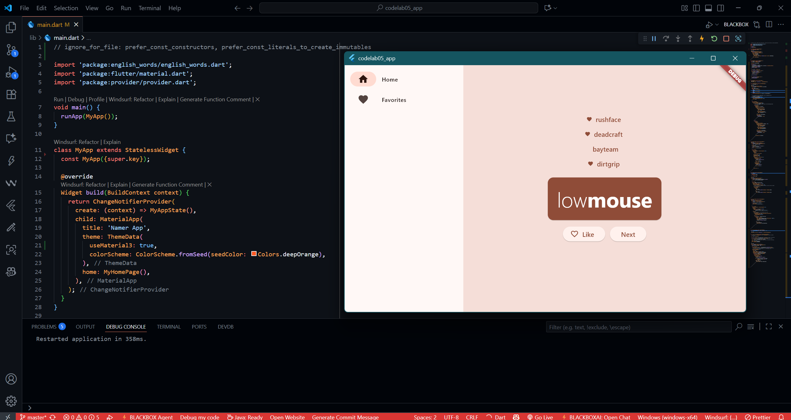
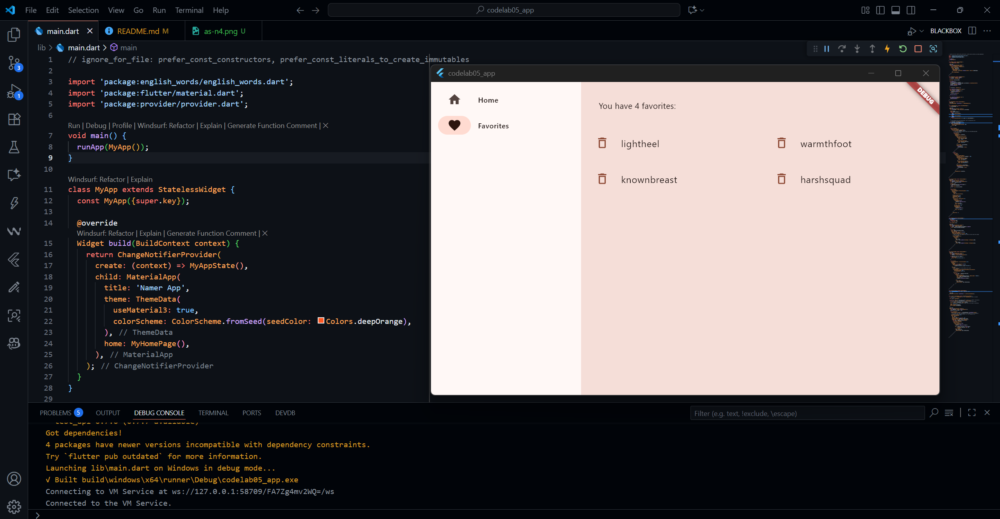

# Practicum Assignment
## Complete Codelabs: Your first Flutter app , then create a lab report and push it to your GitHub repository!

- This application is a Flutter implementation centered on efficient state management using Provider to manage current word pairs, history, and favorites lists. The core of this application's design is adaptive responsiveness, where it uses LayoutBuilder to switch between BottomNavigationBar on small screens and NavigationRail on large screens, with page transitions smoothed by AnimatedSwitcher. The main page displays the word pair generator in an attractive BigCard and includes a HistoryListView with a fading effect that utilizes AnimatedList for gradual history updates, while the favorites page uses an efficient GridView to display and allow for organized deletion of favorite items.