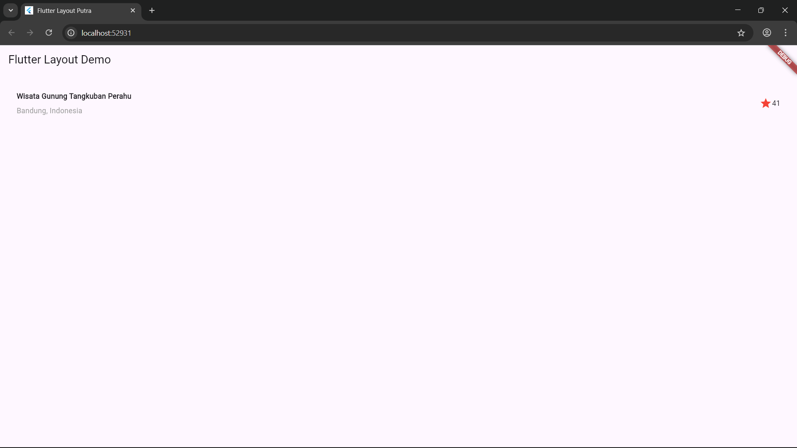
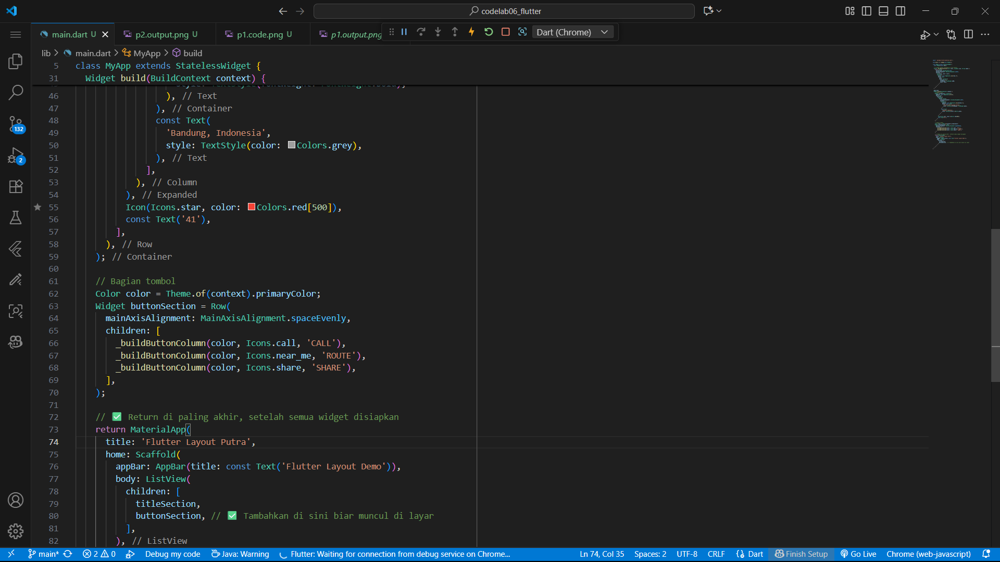
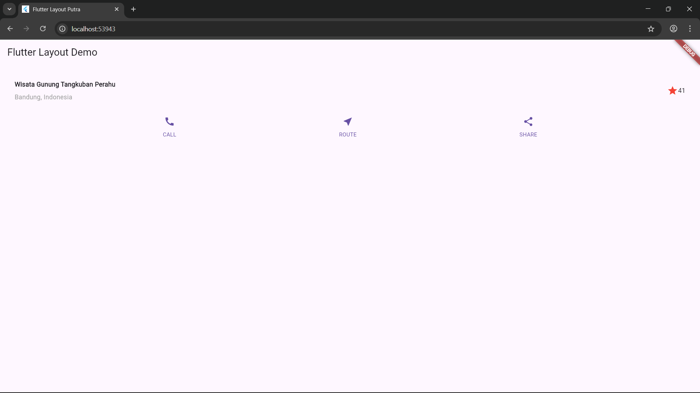
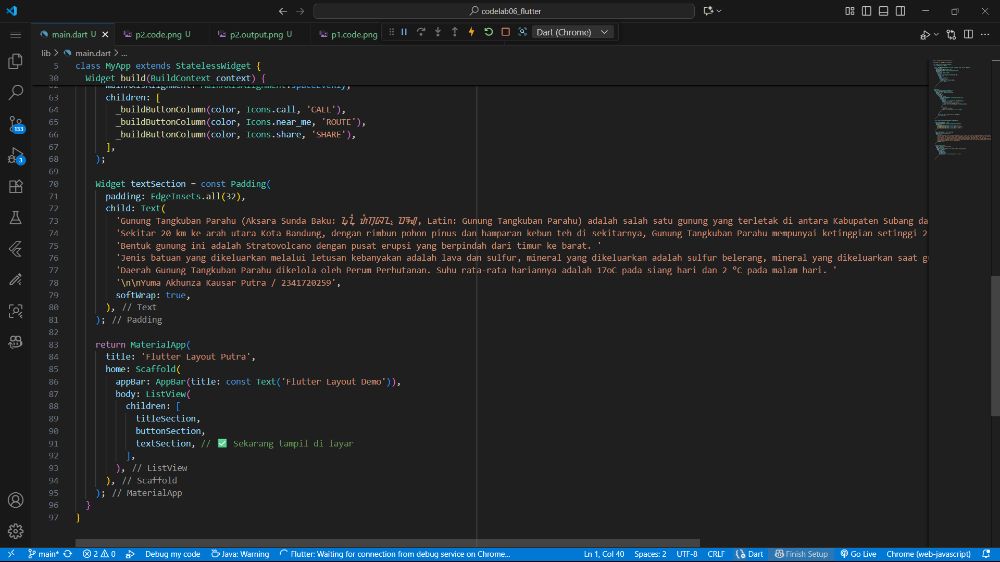
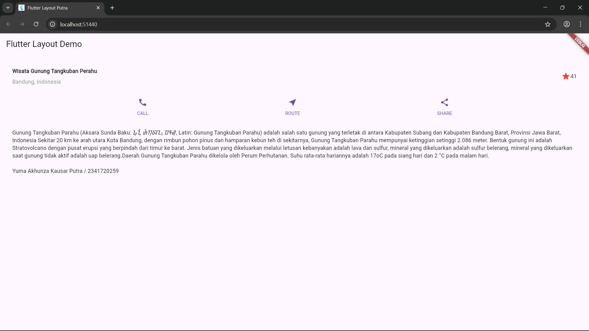
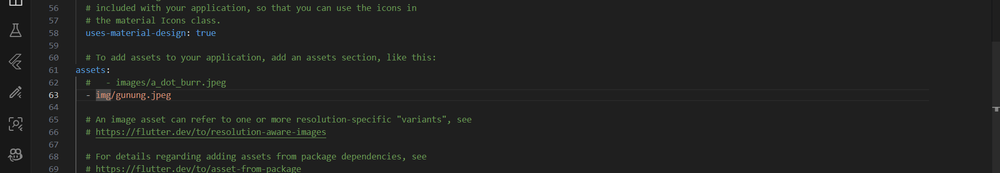
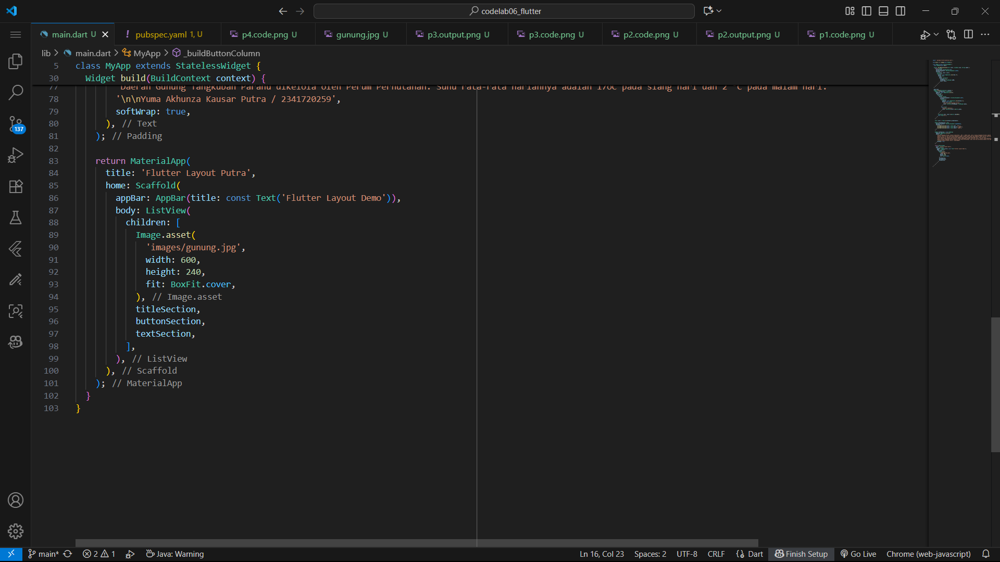
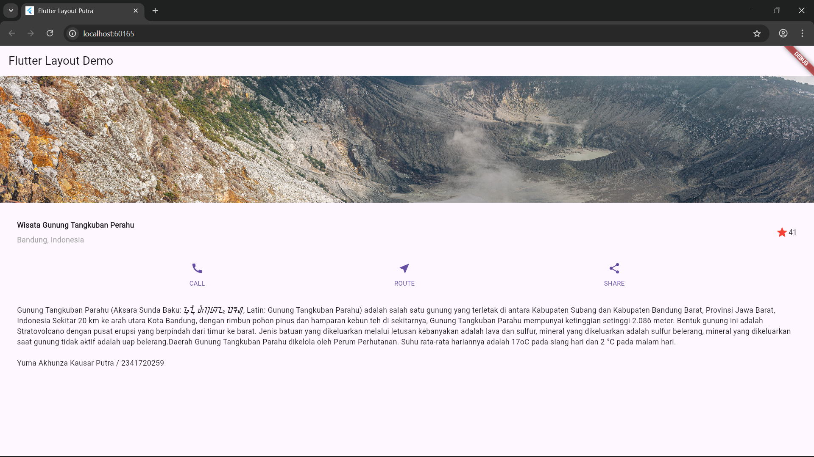

# Praktikum Assignment 1

Codelab 06 Pemrograman Mobile

Name : Yuma Akhunza Kausar Putra
NIM : 2341720259
Absent: 19

Complete Practicals 1 to 4, then document and push them to your repository in the form of screenshots of each work result along with an explanation in the file README.md!

## Practicum 1 : 
1. Building a Layout in Flutter

This practicum focused on understanding Flutter’s layout system by arranging widgets with row, column, and expanded. It involved combining different UI parts to build an organized layout. The row widget was used for horizontal alignment, while the column handled vertical placement, demonstrating Flutter’s versatility. The expanded widget ensured the content adjusted to the available space.

## Practicum 2 : 
2. Implementation of button row

This practicum focused on creating a button row in Flutter by building a reusable widget structure that displays several buttons horizontally, each with an icon and label. A private method named _buildButtonColumn() was used to construct a column containing both an icon and text, encouraging code reusability. The buttonSection widget was then designed using a row to evenly align three button columns. The styling applied Flutter’s primary color to maintain a consistent visual theme.

## Practicum 3 :
3. Implementasi text section

This practicum involved implementing a text section in Flutter using a widget variable named textSection, which applies a padding widget to provide spacing. Inside it, a text widget displays a paragraph describing the “Wisata Gunung Bromo” tourist destination. The softWrap: true property was used to ensure the text remains readable across different screen sizes.

## Practicum 4 :
4. Implementasi image section

In this practicum, I learned how to implement an image section within a Flutter layout. I started by preparing image assets, creating an images folder, and declaring the image path in the pubspec.yaml file. The image was displayed using the Image.asset() widget, with properties such as width, height, and fit: BoxFit.cover to maintain visual quality and avoid distortion. Finally, all components were organized inside a ListView widget to create a scrollable interface, ensuring usability on smaller screens. This activity offered hands-on experience in asset management, image display, and building responsive layouts in Flutter.

