# # Praktikum Assignment 2

Codelab 06 Pemrograman Mobile

Name : Yuma Akhunza Kausar Putra
NIM : 2341720259
Absent: 19

# 1  Prepare new project
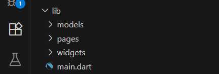
# 2 Define route
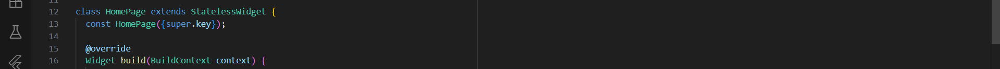
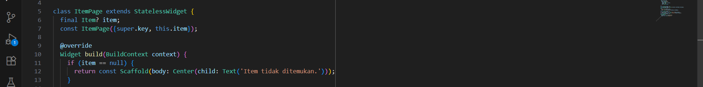
# 3 Main dart
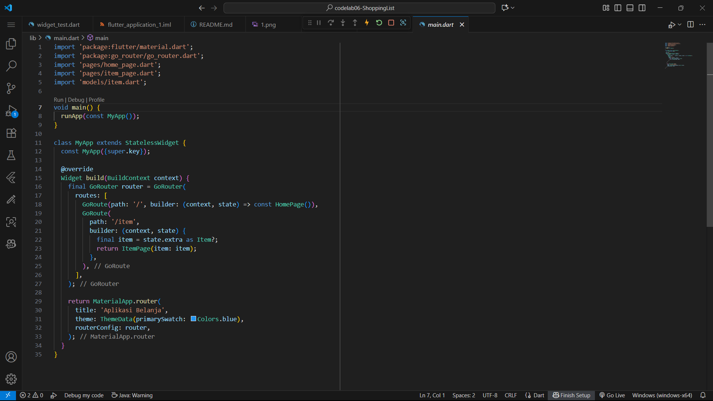
# 4 Make a model
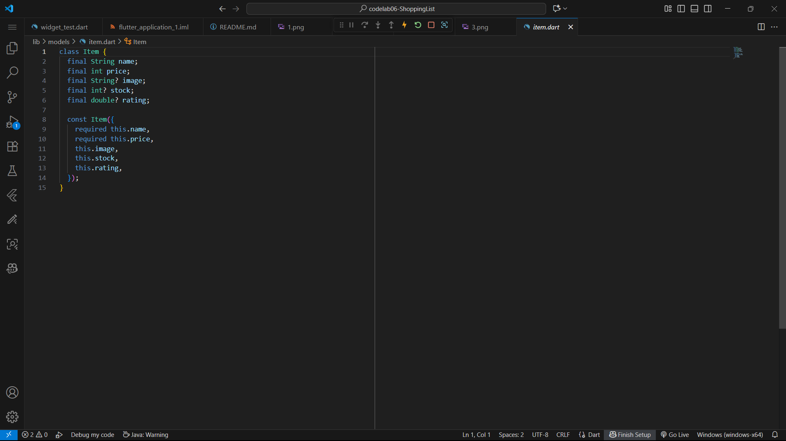
# 5 Complete home page
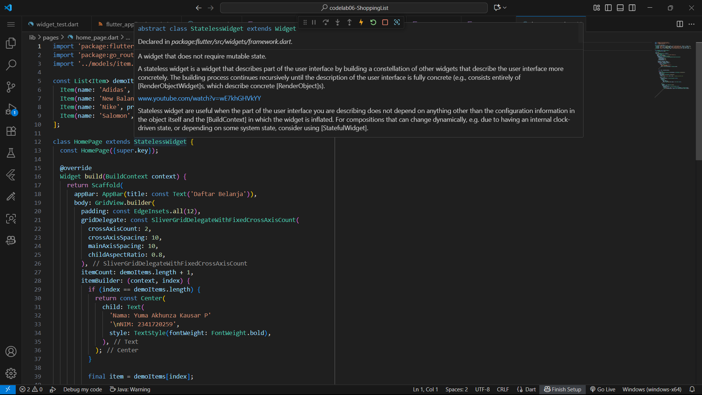
# Final result
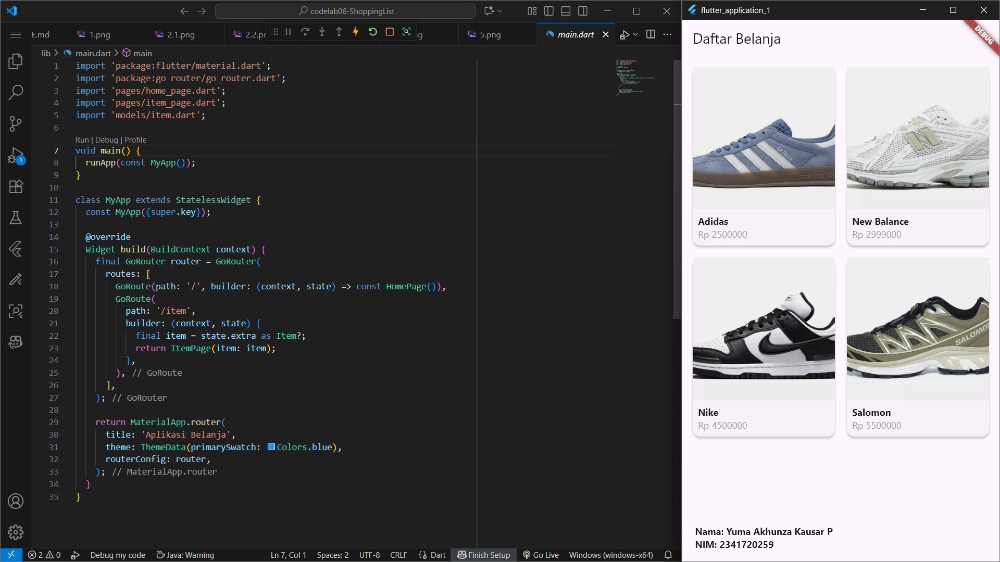
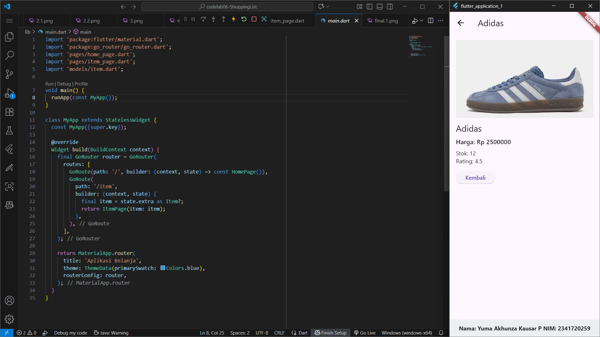
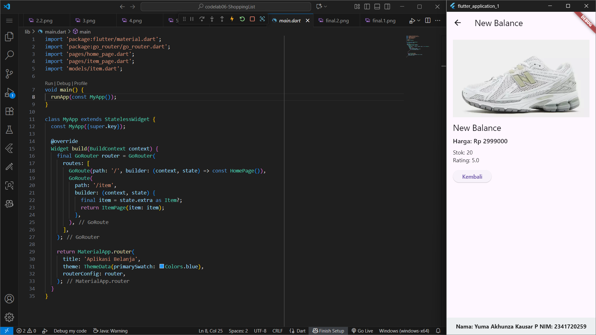
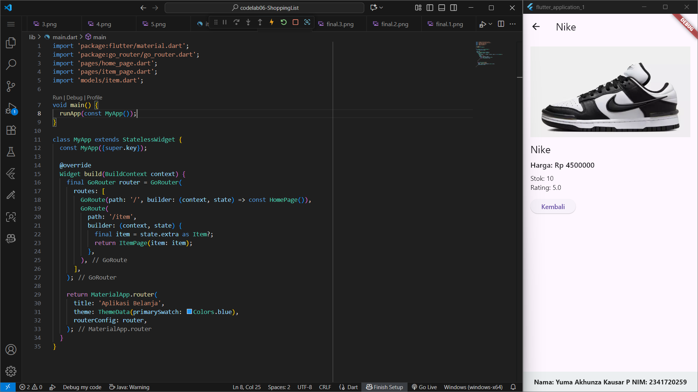
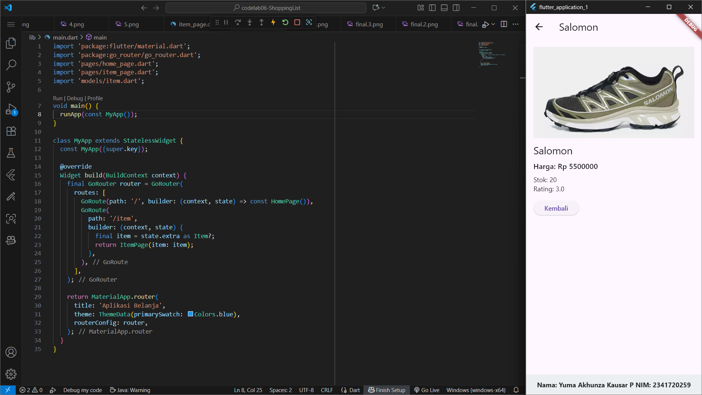