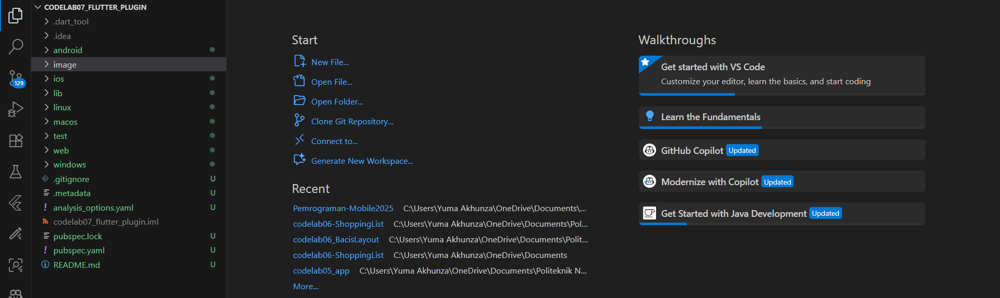
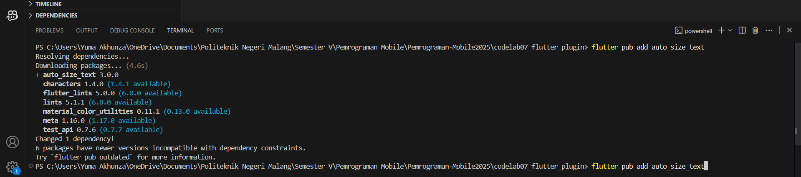
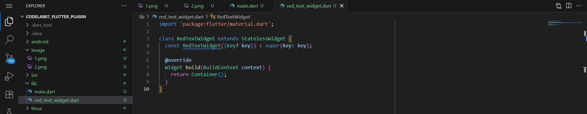
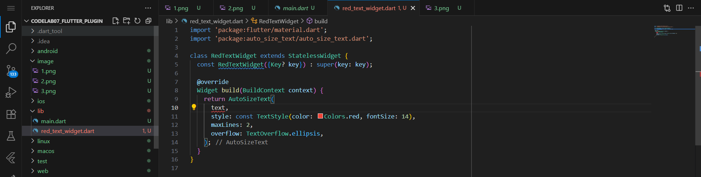
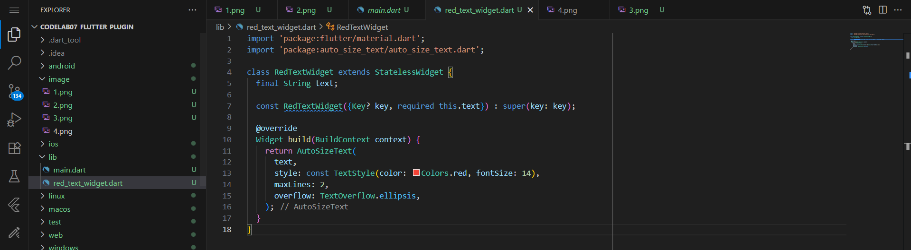
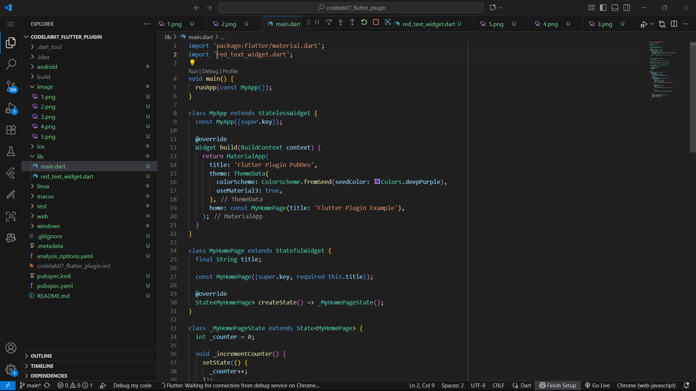
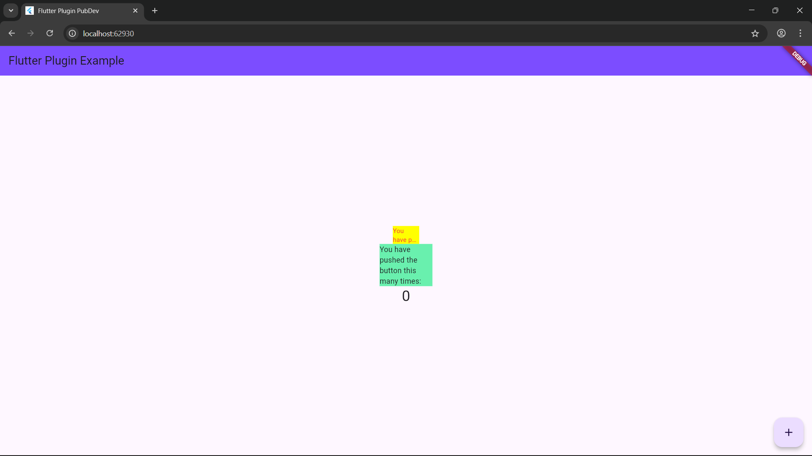

# Practical Implementing Plugins in Flutter Projects

Codelab 07 Pemrograman Mobile

Name : Yuma Akhunza Kausar Putra
NIM : 2341720259
Absent: 19

## Practical 1

### Step 1: Create a New Project
Create a new Flutter project named flutter_plugin_pubdev . Then create a repository on GitHub called flutter_plugin_pubdev .



### Step 2: Adding Plugins
Add the plugin auto_size_textusing the following command in the terminal



If successful, the plugin name and version will appear in the file pubspec.yamlin the dependencies section.

### Step 3: Create a filered_text_widget.dart
Create a new file named red_text_widget.dartin the lib folder then fill in the code as follows.
red_text_widget.dart:



### Step 4: Add AutoSizeText Widget
Still in the file red_text_widget.dart, to use the plugin auto_size_text, change the code return Container()to be as follows.
lib/red_text_widget.dart:



After you add the code above, you'll receive an error message. Why is this? Explain it in your lab report!

Answer:
```dart:
Undefined name 'text'.
```
Because the variable text is not defined anywhere in the class. The AutoSizeText widget requires a String parameter to display, but we haven’t declared or passed any variable to provide that text yet.

You fix this in the next step by declaring a String variable and adding it as a required parameter in the widget’s constructor

### Step 5: Create text variables and parameters in constructor
Add variables textand parameters in the constructor as follows.

red_text_widget.dart:



Now the widget knows what text is and can display it properly.

### Step 6: Add widgets in main.dart
Open the file and then add it main.dartinsidechildren: class _MyHomePageState



Run the application by pressing F5 , the results will be as follows.


## Practical Assignments 
1. Complete the practicum, then document and push it to your repository in the form of a screenshot of the work results along with an explanation in the file README.md! 
- I have worked on the readme for the practical above

2. Explain the purpose of step 2 in the practicum! 
- Step 2:
```dart:
flutter pub add auto_size_text
```
Purpose:
This step adds an external Flutter plugin from pub.dev
, which provides the AutoSizeText widget.
The purpose is to enable automatic text resizing — so the text can adjust its font size to fit within its container without overflowing.

After running the command, Flutter automatically updates the pubspec.yaml file by adding the plugin under the dependencies section.

3.Explain the purpose of step 5 in the practicum! 

- Step 5:
Adding:
```dart:
final String text;
const RedTextWidget({Key? key, required this.text}) : super(key: key);
```

Purpose:

    - Declares a variable (text) to store the message that will be displayed by the widget.

    - Defines a constructor so that the RedTextWidget can receive the text value when it’s used elsewhere (such as in main.dart).

    - The keyword required ensures that the text value must always be provided, avoiding null errors.

This makes the widget reusable and dynamic, allowing different text inputs each time it’s used.

4. In step 6 there are two widgets added, explain their functions and differences! 

- In Step 6, two widgets were added:

RedTextWidget inside :
```dart:
Container(
  color: Colors.yellowAccent,
  width: 50,
  child: const RedTextWidget(
    text: 'You have pushed the button this many times:',
  ),
),
```

    - Uses the AutoSizeText plugin, so the text automatically resizes to fit inside the container.

    - Text color is red, and it can display up to 2 lines with an ellipsis (…) if too long.

- Text inside:
```dart:
Container(
  color: Colors.greenAccent,
  width: 100,
  child: const Text(
    'You have pushed the button this many times:',
  ),
),
```

    - Uses Flutter’s default Text widget, which does not resize automatically.

    - If the text is too long, it might overflow or clip.


5. Explain the meaning of each parameter in the plugin based on the links in this auto_size_text documentation ! 

The AutoSizeText widget in the example:
```dart:
import 'package:flutter/material.dart';
import 'package:auto_size_text/auto_size_text.dart';

class RedTextWidget extends StatelessWidget {
  final String text;

  const RedTextWidget({Key? key, required this.text}) : super(key: key);

  @override
  Widget build(BuildContext context) {
    return AutoSizeText(
      text,
      style: const TextStyle(color: Colors.red, fontSize: 14),
      maxLines: 2,
      overflow: TextOverflow.ellipsis,
    );
  }
}
```
Explanation of parameters:

    - text → This is the string that will be displayed inside the widget. It represents the actual text content shown on the screen.

    - style → This defines how the text looks, including color, font size, weight, and other text styles. In this example, the text is red and has a font size of 14.

    - maxLines → This limits how many lines of text will be shown. If the text exceeds two lines, it will stop displaying beyond that limit.

    - overflow → This determines what happens when the text doesn’t fit in the available space. The TextOverflow.ellipsis setting adds an ellipsis (“…”) at the end of the text to indicate that it continues.

📚 Reference: AutoSizeText documentation on pub.dev

6. Submit your lab report in the form of a GitHub repository link to your lecturer!
