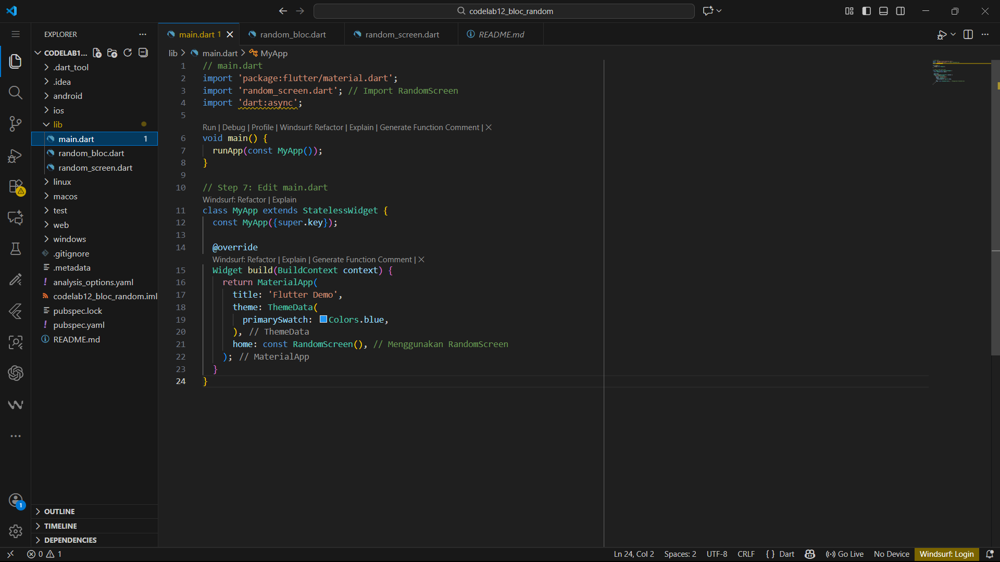
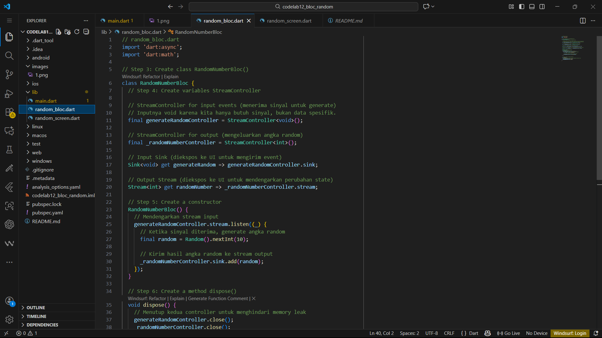
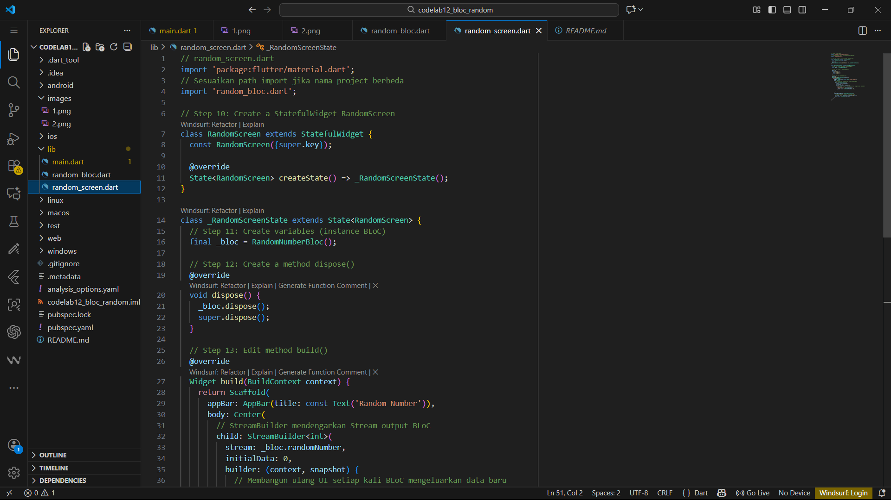
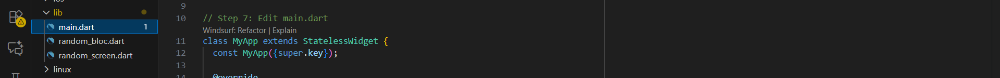
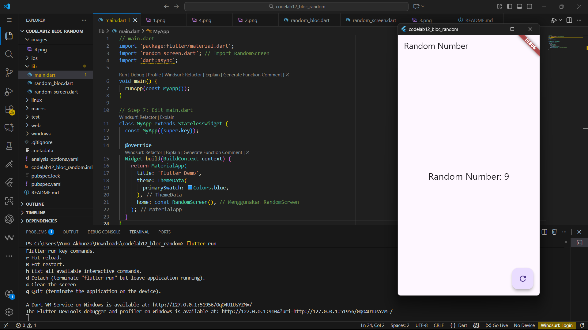
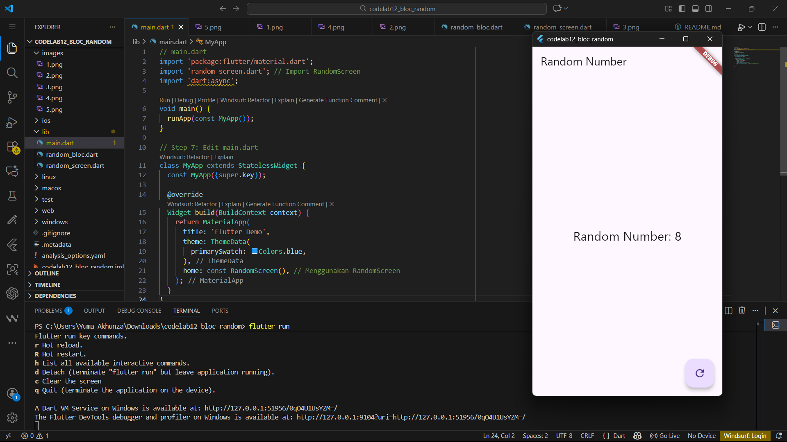

# codelab12_bloc_random

Soal 13:
- Segalanya Adalah Stream: UI mengirimkan event ke BLoC melalui bloc.sink, dan UI menerima state baru dari BLoC melalui bloc.stream.
- Pemisahan Lengkap: Widget RandomScreen tidak tahu bagaimana angka acak dihasilkan; ia hanya tahu cara mengirim sinyal permintaan dan cara menampilkan data yang masuk. Logika Random().nextInt(10) sepenuhnya terisolasi dalam RandomNumberBloc.
- Manajemen Siklus Hidup: BLoC diinisialisasi di initState() dan dibersihkan (dispose()) di widget dispose(), memastikan Streams ditutup, yang merupakan best practice BLoC untuk menghindari memory leaks.