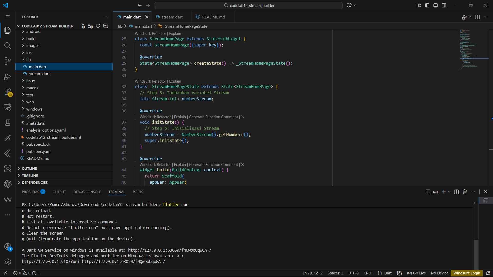
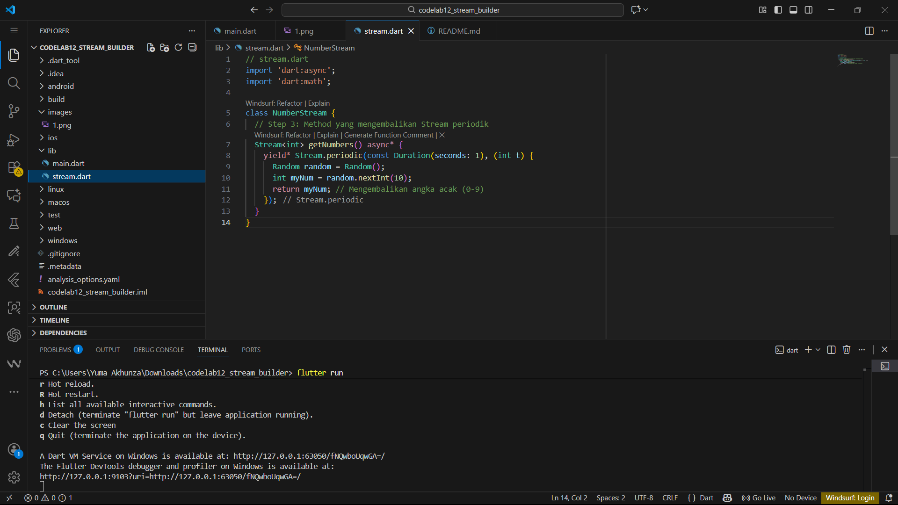
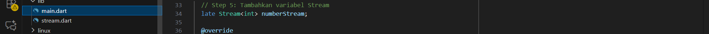
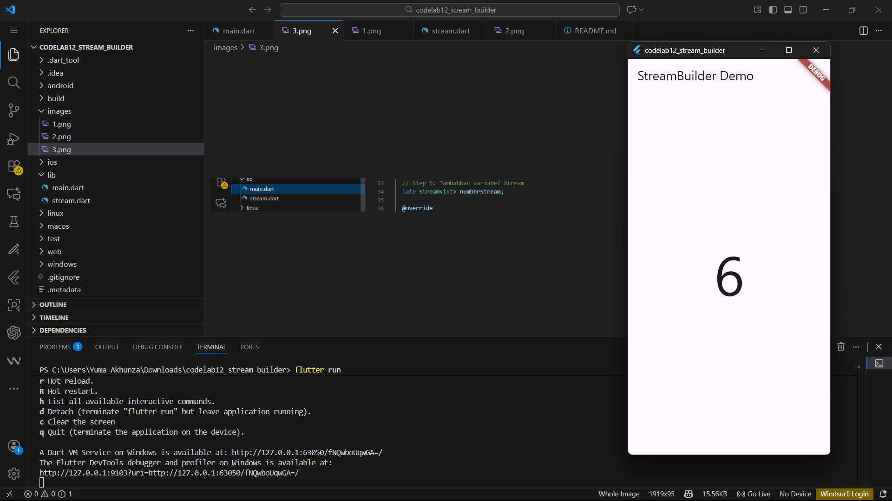
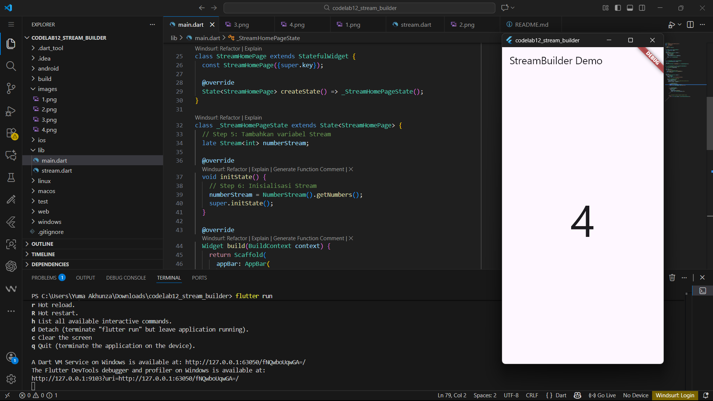

# codelab12_stream_builder

# Praktikum 6 | streambuilder_putra

Soal 12:
- kode langkah 3 | Kode ini berfungsi sebagai produsen data Stream yang secara periodik (berkala) menghasilkan urutan bilangan bulat yang terus meningkat.
- kode langkah 7 | Menggunakan Widget StreamBuilder untuk secara reaktif membangun ulang (rebuild) UI setiap kali ada data baru yang masuk dari Stream.

