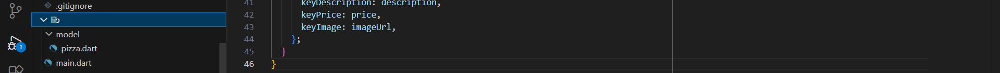
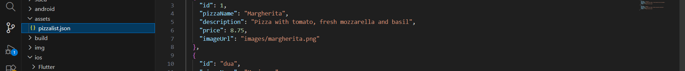
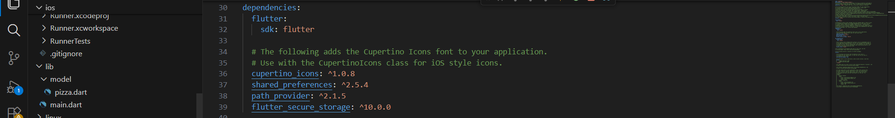
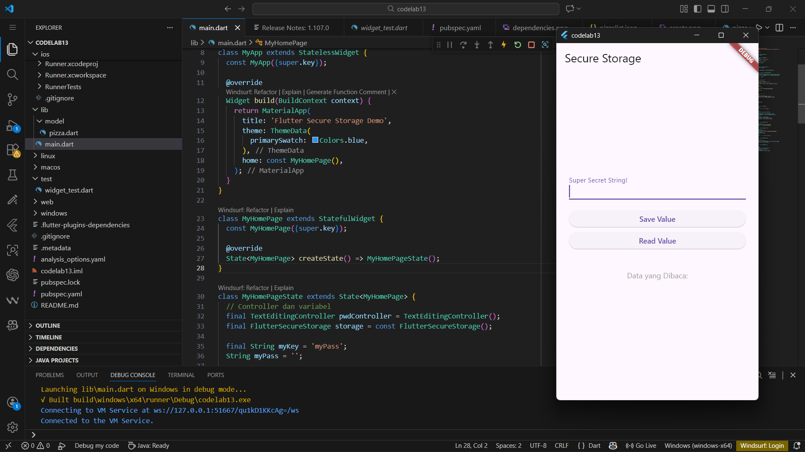
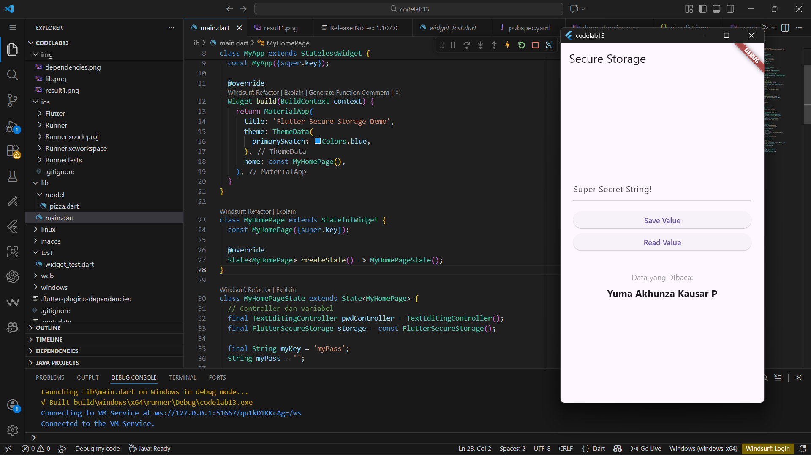
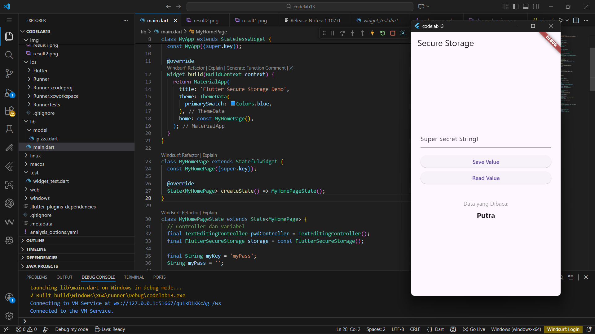

# codelab13_Secure_Storage

Yuma Akhunza Kausar Putra

2341720259

19


# Week 13





main.dart
```import 'package:flutter/material.dart';
import 'package:flutter_secure_storage/flutter_secure_storage.dart';

void main() {
  runApp(const MyApp());
}

class MyApp extends StatelessWidget {
  const MyApp({super.key});

  @override
  Widget build(BuildContext context) {
    return MaterialApp(
      title: 'Flutter Secure Storage Demo',
      theme: ThemeData(
        primarySwatch: Colors.blue,
      ),
      home: const MyHomePage(),
    );
  }
}

class MyHomePage extends StatefulWidget {
  const MyHomePage({super.key});

  @override
  State<MyHomePage> createState() => MyHomePageState();
}

class MyHomePageState extends State<MyHomePage> {
  // Controller dan variabel
  final TextEditingController pwdController = TextEditingController();
  final FlutterSecureStorage storage = const FlutterSecureStorage();

  final String myKey = 'myPass';
  String myPass = '';

  // -----------------------------
  // WRITE + langsung READ ulang
  // -----------------------------
  Future<void> writeToSecureStorage() async {
    // Simpan ke storage
    await storage.write(key: myKey, value: pwdController.text);

    // Kosongkan input
    pwdController.clear();

    // Baca ulang & update UI
    final savedValue = await readFromSecureStorage();
    setState(() {
      myPass = savedValue;
    });
  }

  // -----------------------------
  // READ dari storage
  // -----------------------------
  Future<String> readFromSecureStorage() async {
    final String? value = await storage.read(key: myKey);
    return value ?? '';
  }

  @override
  void dispose() {
    pwdController.dispose();
    super.dispose();
  }

  @override
  Widget build(BuildContext context) {
    return Scaffold(
      appBar: AppBar(
        title: const Text('Secure Storage'),
      ),
      body: Center(
        child: Padding(
          padding: const EdgeInsets.all(24.0),
          child: Column(
            mainAxisAlignment: MainAxisAlignment.center,
            crossAxisAlignment: CrossAxisAlignment.stretch,
            children: [
              TextField(
                controller: pwdController,
                decoration: const InputDecoration(
                  labelText: 'Super Secret String!',
                ),
              ),

              const SizedBox(height: 20),

              ElevatedButton(
                onPressed: writeToSecureStorage,
                child: const Text('Save Value'),
              ),

              const SizedBox(height: 10),

              ElevatedButton(
                onPressed: () async {
                  final value = await readFromSecureStorage();
                  setState(() {
                    myPass = value;
                  });
                },
                child: const Text('Read Value'),
              ),

              const SizedBox(height: 40),

              const Text(
                'Data yang Dibaca:',
                style: TextStyle(fontSize: 14, color: Colors.grey),
                textAlign: TextAlign.center,
              ),

              const SizedBox(height: 8),

              Text(
                myPass,
                textAlign: TextAlign.center,
                style: const TextStyle(
                  fontSize: 18,
                  fontWeight: FontWeight.bold,
                ),
              ),
            ],
          ),
        ),
      ),
    );
  }
}
```
pizza.dart
```
// Step 1: Deklarasi Konstanta untuk Kunci JSON
const keyId = 'id';
const keyName = 'pizzaName';
const keyDescription = 'description';
const keyPrice = 'price';
const keyImage = 'imageUrl';

class Pizza {
  final int id;
  final String pizzaName;
  final String description;
  final double price;
  final String imageUrl;

  // Step 2: Konstruktor fromJson() menggunakan Konstanta dan Robustness
  Pizza.fromJson(Map<String, dynamic> json) :
      // ID: tryParse & ?? 0
      id = int.tryParse(json[keyId].toString()) ?? 0,
      
      // pizzaName: Ternary Operator untuk 'No name'
      pizzaName = json[keyName] != null 
          ? json[keyName].toString() 
          : 'No name',
      
      // description: Ternary Operator untuk '' (string kosong)
      description = json[keyDescription] != null
          ? json[keyDescription].toString()
          : '',
      
      // price: double.tryParse & ?? 0.0
      price = double.tryParse(json[keyPrice].toString()) ?? 0.0,
      
      // imageUrl: Null Coalescing sederhana
      imageUrl = (json[keyImage] ?? '').toString();

  // Step 3: Metode toJson() menggunakan Konstanta
  Map<String, dynamic> toJson() {
    return {
      keyId: id,
      keyName: pizzaName,
      keyDescription: description,
      keyPrice: price,
      keyImage: imageUrl,
    };
  }
}
```






### Soal 5:
Jelaskan maksud kode lebih safe dan maintainable!
- Lebih Safe (Aman): Menghindari kesalahan pengetikan (typo).

Tanpa Konstanta: Jika kita mengetik json['pizzaNam'] (kurang huruf 'e'), editor kode tidak akan menganggapnya error, tetapi aplikasi akan error saat dijalankan (runtime error) atau data menjadi null.

Dengan Konstanta: Jika kita salah ketik nama variabel json[keyNam], editor kode akan langsung memberi garis merah (compile-time error) karena variabel tersebut tidak dikenali. Ini mencegah bug lolos ke aplikasi jadi.

- Lebih Maintainable (Mudah Dikelola): Memudahkan perubahan di masa depan.

Jika backend mengubah nama kunci JSON dari 'pizzaName' menjadi 'productName', kita hanya perlu mengubah satu baris kode saja (di bagian deklarasi const String keyName = ...). Kita tidak perlu mencari dan mengganti satu per satu di seluruh file proyek (fromJson, toJson, dll).

### Soal 8:
Jelaskan maksud kode pada langkah 3 dan 7 !
- Penjelasan Kode Langkah 3 (Method writeFile)

Method writeFile adalah fungsi asynchronous (async) yang bertugas menulis data teks ke dalam penyimpanan lokal perangkat.

- Penjelasan Kode Langkah 7 (Proses Run/Read)
Pada langkah ini, alur yang terjadi adalah:

Aplikasi dijalankan, initState otomatis membuat file berisi Nama & NIM di background (tanpa tampil di layar dulu).

Saat pengguna menekan tombol "Read File", method readFile() dipanggil.

myFile.readAsString() membaca isi file teks dari penyimpanan lokal.

Setelah isi didapat, setState(() { fileText = content; }) dijalankan. Fungsi setState ini memberitahu Flutter bahwa ada data yang berubah, sehingga Flutter melakukan Rebuild (menggambar ulang) tampilan UI untuk menampilkan teks Nama & NIM yang baru saja dibaca.
