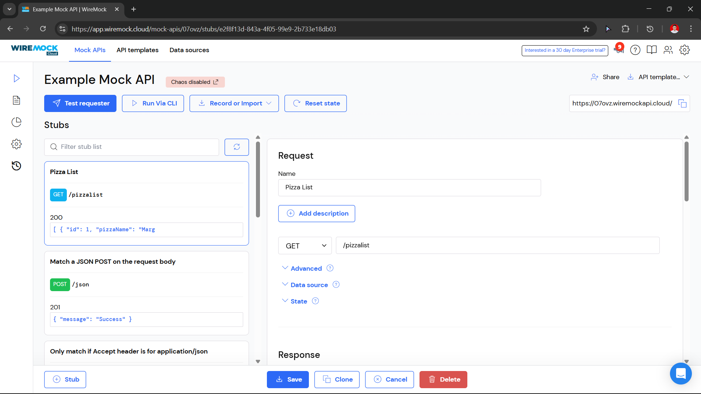
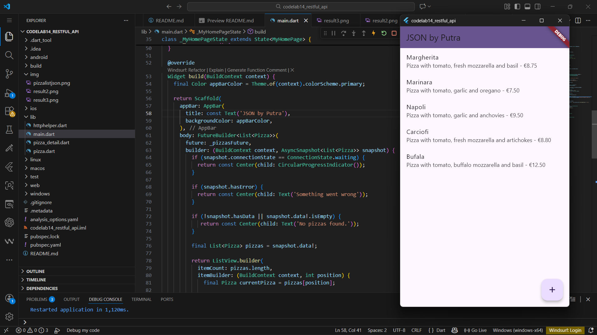
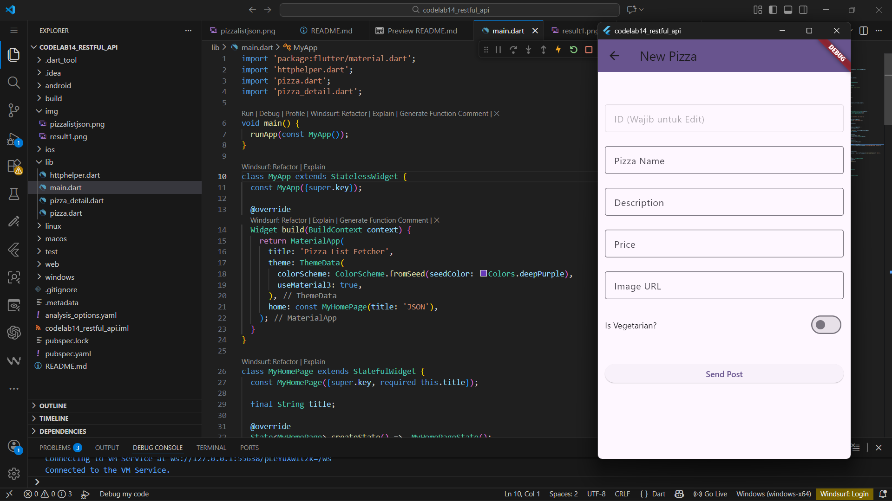
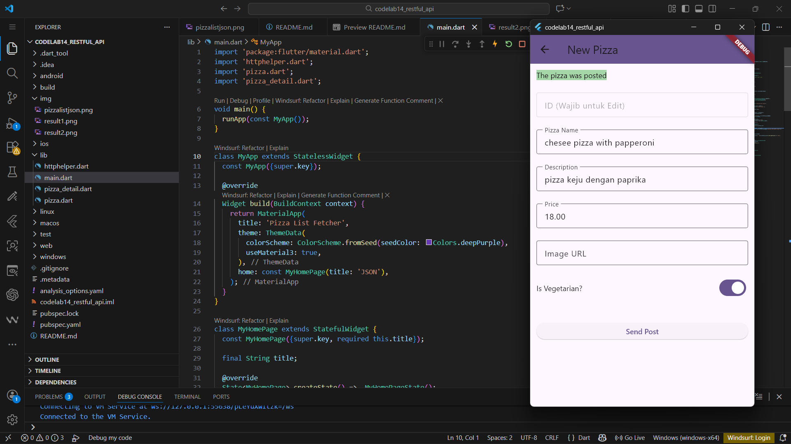
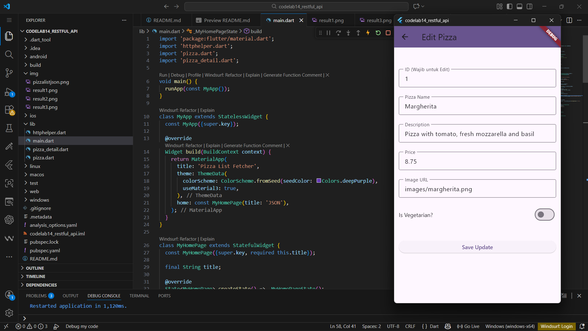

# codelab14_restful_api


Yuma Akhunza Kausar Putra

2341720259

19


# Week 14




## httphelper.dart
```import 'dart:io';
import 'package:http/http.dart' as http;
import 'dart:convert';
import 'pizza.dart'; 

class HttpHelper {
  final String authority = 'm9rqg.wiremockapi.cloud';
  final String path = 'pizzalist';

  static final HttpHelper _httpHelper = HttpHelper._internal();
  factory HttpHelper() {
    return _httpHelper;
  }
  HttpHelper._internal() {}

  Future<List<Pizza>> getPizzaList() async {
    final Uri url = Uri.https(authority, path);
    final http.Response result = await http.get(url);

    if (result.statusCode == HttpStatus.ok) {
      final jsonResponse = json.decode(result.body);
      List<Pizza> pizzas =
          jsonResponse.map<Pizza>((i) => Pizza.fromJson(i)).toList();
      return pizzas;
    } else {
      print('GET Request Failed with status: ${result.statusCode}');
      return [];
    }
  }

  Future<String> postPizza(Pizza pizza) async {
    const postPath = '/pizza';
    String post = json.encode(pizza.toJson()); 
    Uri url = Uri.https(authority, postPath);
    
    http.Response r = await http.post(
      url,
      headers: <String, String>{
        'Content-Type': 'application/json; charset=UTF-8',
      },
      body: post,
    );
    return r.body; 
  }

  Future<String> putPizza(Pizza pizza) async {
    const putPath = '/pizza';
    String put = json.encode(pizza.toJson());
    Uri url = Uri.https(authority, putPath);
    
    http.Response r = await http.put(
      url,
      headers: <String, String>{
        'Content-Type': 'application/json; charset=UTF-8',
      },
      body: put,
    );
    return r.body;
  }

  Future<String> deletePizza(int id) async {
    // Catatan: Dalam API REST nyata, path biasanya /pizza/{id}
    const deletePath = '/pizza'; 
    Uri url = Uri.https(authority, deletePath);
    
    http.Response r = await http.delete( // Menggunakan http.delete
      url,
    );
    return r.body;
  }
}
```


## pizza_detail.dart
```import 'package:flutter/material.dart';
import 'pizza.dart';
import 'httphelper.dart';
import 'dart:convert';

class PizzaDetailScreen extends StatefulWidget {

  final Pizza pizza;
  final bool isNew;

  const PizzaDetailScreen(
      {super.key, required this.pizza, required this.isNew}); 

  @override
  State<PizzaDetailScreen> createState() => _PizzaDetailScreenState();
}

class _PizzaDetailScreenState extends State<PizzaDetailScreen> {
  final TextEditingController txtId = TextEditingController();
  final TextEditingController txtName = TextEditingController();
  final TextEditingController txtDescription = TextEditingController();
  final TextEditingController txtPrice = TextEditingController();
  final TextEditingController txtImageUrl = TextEditingController();
  
  bool isVegetarian = false; 
  String operationResult = '';

  @override
  void initState() {
    if (!widget.isNew) {
      // Jika mode EDIT (PUT): isi field dengan data pizza lama
      txtId.text = widget.pizza.id?.toString() ?? '';
      txtName.text = widget.pizza.pizzaName;
      txtDescription.text = widget.pizza.description;
      txtPrice.text = widget.pizza.price?.toString() ?? '';
      txtImageUrl.text = widget.pizza.imageUrl ?? '';
      isVegetarian = widget.pizza.isVegetarian;
    } else {
      // Jika mode ADD NEW (POST): set nilai default
      txtId.text = '';
      isVegetarian = false;
    }
    super.initState();
  }
  
  @override
  void dispose() {
    txtId.dispose();
    txtName.dispose();
    txtDescription.dispose();
    txtPrice.dispose();
    txtImageUrl.dispose();
    super.dispose();
  }

  Future savePizza() async {
    HttpHelper helper = HttpHelper();
    
    // 1. Buat objek Pizza dari input UI
    Pizza pizza = Pizza(
      id: int.tryParse(txtId.text), 
      pizzaName: txtName.text,
      description: txtDescription.text,
      price: double.tryParse(txtPrice.text),
      imageUrl: txtImageUrl.text,
      isVegetarian: isVegetarian, 
    );

    // 2. Tentukan apakah POST atau PUT
    final result = await (widget.isNew
        ? helper.postPizza(pizza) // POST jika isNew = true
        : helper.putPizza(pizza));  // PUT jika isNew = false
    
    // 3. Perbarui UI dengan hasil
    setState(() {
      try {
        final jsonResult = json.decode(result);
        operationResult = jsonResult['message'] ?? result;
      } catch (e) {
        operationResult = result;
      }
    });
  }

  @override
  Widget build(BuildContext context) {
    return Scaffold(
      appBar: AppBar(
        title: Text(widget.isNew ? 'New Pizza' : 'Edit Pizza'), 
        backgroundColor: Theme.of(context).colorScheme.primary,
      ),
      body: Padding(
        padding: const EdgeInsets.all(12),
        child: SingleChildScrollView(
          child: Column(
            crossAxisAlignment: CrossAxisAlignment.stretch,
            children: <Widget>[
              Text(
                operationResult,
                style: TextStyle(
                    backgroundColor: operationResult.contains('updated') || operationResult.contains('posted') ? Colors.green[200] : Colors.grey[200],
                    color: Colors.black),
              ),
              const SizedBox(height: 24),
              
              // Field ID: Penting untuk PUT
              TextField(
                controller: txtId,
                keyboardType: TextInputType.number,
                enabled: !widget.isNew, // ID biasanya tidak bisa diubah saat edit
                decoration: InputDecoration(
                  hintText: 'Insert ID',
                  labelText: 'ID (Wajib untuk Edit)',
                  border: OutlineInputBorder(),
                ),
              ),
              const SizedBox(height: 24),
              TextField(
                controller: txtName,
                decoration: const InputDecoration(hintText: 'Insert Pizza Name', labelText: 'Pizza Name', border: OutlineInputBorder()),
              ),
              const SizedBox(height: 24),
              TextField(
                controller: txtDescription,
                decoration: const InputDecoration(hintText: 'Insert Description', labelText: 'Description', border: OutlineInputBorder()),
              ),
              const SizedBox(height: 24),
              TextField(
                controller: txtPrice,
                keyboardType: TextInputType.number,
                decoration: const InputDecoration(hintText: 'Insert Price', labelText: 'Price', border: OutlineInputBorder()),
              ),
              const SizedBox(height: 24),
              TextField(
                controller: txtImageUrl,
                decoration: const InputDecoration(hintText: 'Insert Image Url', labelText: 'Image URL', border: OutlineInputBorder()),
              ),
              const SizedBox(height: 24),
              Row(
                mainAxisAlignment: MainAxisAlignment.spaceBetween,
                children: [
                  const Text('Is Vegetarian?'),
                  Switch(
                    value: isVegetarian,
                    onChanged: (bool value) {
                      setState(() {
                        isVegetarian = value;
                      });
                    },
                  ),
                ],
              ),
              const SizedBox(height: 48),

              // Tombol yang memanggil savePizza()
              ElevatedButton(
                onPressed: savePizza,
                child: Text(widget.isNew ? 'Send Post' : 'Save Update'),
              ),
            ],
          ),
        ),
      ),
    );
  }
}
```

## pizza.dart
```class Pizza {
  int? id;
  String pizzaName;
  String description;
  double? price;
  String? imageUrl;
  
  bool isVegetarian; 

  Pizza({
    this.id,
    required this.pizzaName,
    required this.description,
    this.price,
    this.imageUrl,
    this.isVegetarian = false,
  });

  factory Pizza.fromJson(Map<String, dynamic> json) {
    return Pizza(
      id: json['id'] as int?,
      pizzaName: json['pizzaName'] as String,
      description: json['description'] as String,
      price: json['price'] is int 
          ? (json['price'] as int).toDouble() 
          : json['price'] as double?,
      imageUrl: json['imageUrl'] as String?,
      isVegetarian: json['isVegetarian'] as bool? ?? false, 
    );
  }

  Map<String, dynamic> toJson() => {
    'id': id,
    'pizzaName': pizzaName,
    'description': description,
    'price': price,
    'imageUrl': imageUrl,
    'isVegetarian': isVegetarian,
  };
}
```

## main.dart
```import 'package:flutter/material.dart';
import 'httphelper.dart'; 
import 'pizza.dart'; 
import 'pizza_detail.dart'; 

void main() {
  runApp(const MyApp());
}

class MyApp extends StatelessWidget {
  const MyApp({super.key});

  @override
  Widget build(BuildContext context) {
    return MaterialApp(
      title: 'Pizza List Fetcher',
      theme: ThemeData(
        colorScheme: ColorScheme.fromSeed(seedColor: Colors.deepPurple), 
        useMaterial3: true,
      ),
      home: const MyHomePage(title: 'JSON'),
    );
  }
}

class MyHomePage extends StatefulWidget {
  const MyHomePage({super.key, required this.title});

  final String title;

  @override
  State<MyHomePage> createState() => _MyHomePageState();
}

class _MyHomePageState extends State<MyHomePage> {
  HttpHelper helper = HttpHelper(); 
  // ✅ State untuk menyimpan Future agar dapat dimuat ulang
  late Future<List<Pizza>> _pizzasFuture;

  @override
  void initState() {
    super.initState();
    _pizzasFuture = helper.getPizzaList();
  }

  void _refreshList() {
    setState(() {
      _pizzasFuture = helper.getPizzaList(); 
    });
  }

  @override
  Widget build(BuildContext context) {
    final Color appBarColor = Theme.of(context).colorScheme.primary;

    return Scaffold(
      appBar: AppBar(
        title: const Text('JSON by Golden'), 
        backgroundColor: appBarColor, 
      ),
      body: FutureBuilder<List<Pizza>>(
        future: _pizzasFuture,
        builder: (BuildContext context, AsyncSnapshot<List<Pizza>> snapshot) {
          if (snapshot.connectionState == ConnectionState.waiting) {
            return const Center(child: CircularProgressIndicator());
          }
          
          if (snapshot.hasError) {
            return const Center(child: Text('Something went wrong'));
          }

          if (!snapshot.hasData || snapshot.data!.isEmpty) {
             return const Center(child: Text('No pizzas found.'));
          }
          
          final List<Pizza> pizzas = snapshot.data!;

          return ListView.builder(
            itemCount: pizzas.length, 
            itemBuilder: (BuildContext context, int position) {
              final Pizza currentPizza = pizzas[position];
              
              return Dismissible(
                key: Key(currentPizza.id?.toString() ?? currentPizza.pizzaName), 
                direction: DismissDirection.startToEnd, 
                background: Container(
                  color: Colors.red,
                  alignment: Alignment.centerLeft,
                  padding: const EdgeInsets.only(left: 20.0),
                  child: const Icon(Icons.delete, color: Colors.white),
                ),
                onDismissed: (direction) async {

                  HttpHelper helper = HttpHelper();
                  if (currentPizza.id != null) {
                    await helper.deletePizza(currentPizza.id!);
                  }
                  
                  ScaffoldMessenger.of(context).showSnackBar(
                      SnackBar(content: Text('${currentPizza.pizzaName} dismissed (API DELETE called)')));
                  
                  _refreshList(); 
                },
                
                child: ListTile(
                  title: Text(currentPizza.pizzaName),
                  subtitle: Text(
                    '${currentPizza.description} - €${currentPizza.price?.toStringAsFixed(2) ?? 'N/A'}',
                  ),
                  onTap: () {
                     Navigator.push(
                        context,
                        MaterialPageRoute(
                           builder: (context) => PizzaDetailScreen(
                              pizza: currentPizza, 
                              isNew: false)),      
                      ).then((_) => _refreshList());
                  },
                ),
              );
            },
          );
        },
      ),
      
      floatingActionButton: FloatingActionButton(
        child: const Icon(Icons.add),
        onPressed: () {
          Navigator.push(
            context,
            MaterialPageRoute(
                builder: (context) => PizzaDetailScreen(
                      pizza: Pizza(
                        pizzaName: '', 
                        description: '',
                      ), 
                      isNew: true,
                    )),
          ).then((_) => _refreshList()); 
        },
      ),
    );
  }
}
```

## Result



