# Jobsheet 5

Name : Yuma Akhunza Kausar Putra
NIM : 2341720259
Absent: 19

## Practical 1

### Step 1

This step is a quick way to access all available commands in VS Code, including those added by the Flutter extension.

1. Open the Visual Studio Code application.

2. Press the keys Ctrl + Shift + P simultaneously.

3. A search box will appear at the top of the screen. Type Flutter.

4. From the list that appears, click on the option Flutter: New Application Project.

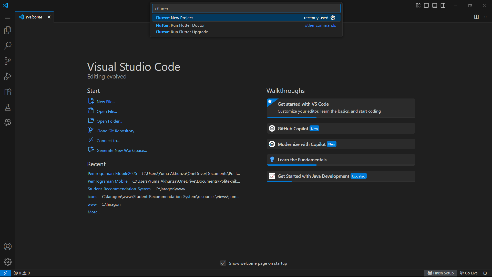

Explanation: The Command Palette is like a "command center" in VS Code. Instead of hunting through menus, you can directly type any command you need. The Flutter: New Application Project command comes from the Flutter extension and is designed to create the entire basic folder and file structure needed for a Flutter app.

### Step 2: Select the Project Location

Now, Flutter needs to know where you want to save all the files for this new project.

1. After selecting "New Application Project", a file explorer window will open.

2. Navigate to the location where you usually save your coursework, for example, Documents/Practicals or another easy-to-find folder.

3. Do not enter an existing project folder. Simply select the "parent" folder where your new project will be created.

4. Click the "Select a folder to create the project in" button.

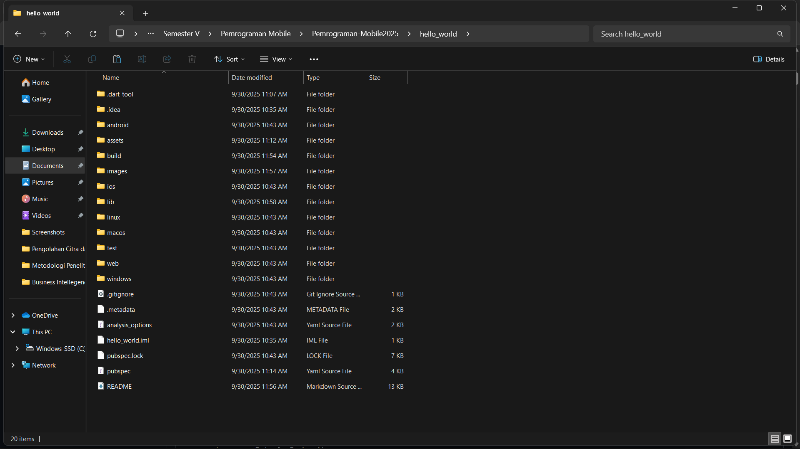

Explanation: 📁 It's good practice to choose a neat and not-too-deep file path (e.g., C:\Users\YourName\Documents\…) to avoid potential issues with long path names, which can sometimes cause errors on certain operating systems.

### Step 3: Name Your Project
Every project needs a unique name as an identifier.

After selecting the folder, VS Code will prompt you to enter a project name.

Type hello_world and press Enter.

Important Rules for Project Names:

Use only lowercase letters.

Use underscores (_) instead of spaces.

The name cannot start with a number or a special character.

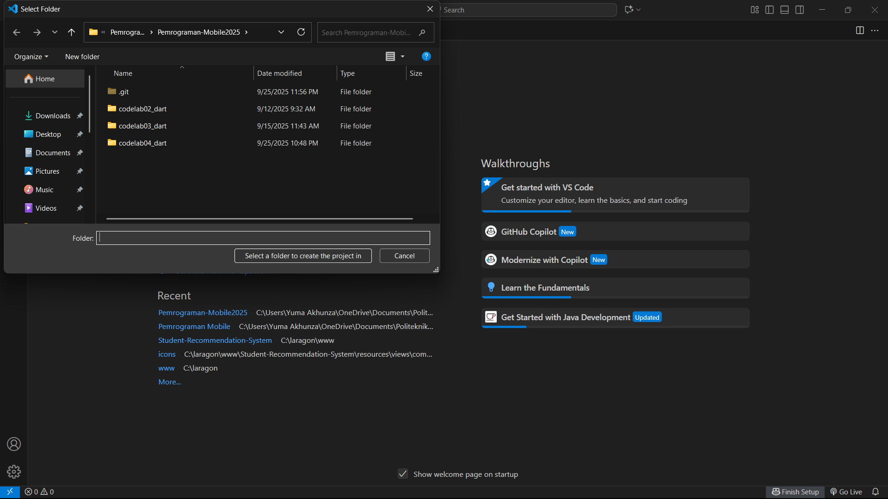

Explanation: 📝 These naming rules are mandatory because the project name is also used as the package name in the Dart/Flutter ecosystem. After you press Enter, Flutter will start working in the background, creating the hello_world folder and populating it with all the necessary template files. This process might take a few seconds to a minute.

### Step 4: Project Successfully Created
If all steps were done correctly, VS Code will open a new window containing your complete Flutter project.

You will see:

The project's folder structure in the panel on the left (containing folders like lib, android, ios, etc.).

The lib/main.dart file will be automatically opened in the main editor.

A success message will appear in the bottom-right corner.

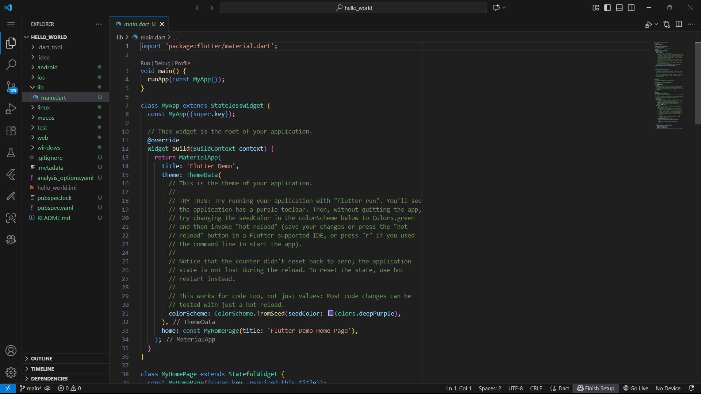

Explanation: ✅ Congratulations! You have successfully created your first Flutter project. The main.dart file inside the lib folder is the starting point of your application. This is where the code for the default demo app (a simple counter app) is located.

## Practical 2: Connecting an Android Device or Emulator

Continuing from lab 1, you'll be asked to run the application on a physical device (Android or iOS). Please follow the steps in the codelab linked below.

https://developer.android.com/codelabs/basic-android-kotlin-compose-connect-device?hl=en#0

### Step 1. Enable USB Debugging on Your Device 📱
First, you need to unlock a hidden settings menu called Developer Options on your Android device.

Open your device's Settings app and scroll down to About phone.

Find the Build number and tap it seven times in a row. You'll see a message that says, "You are now a developer!"

Go back to the main Settings screen, then navigate to System > Developer options.

Inside Developer options, find the USB debugging toggle and turn it on. You may need to accept a confirmation prompt.

### Srep2. Running Your App on an Android Device with a Cable
After you have enabled USB Debugging on your device, follow these steps:

1.Connect Your Device 🔌
Connect your Android phone or tablet to your computer using a USB cable.

2.Allow USB Debugging
On your Android device's screen, a pop-up dialog with the title "Allow USB debugging?" will appear.

Check the box for "Always allow from this computer" (so you w3.on't be asked again every time you connect this device).

Tap OK.

3.Select the Device in Android Studio
Back in Android Studio on your computer, look at the toolbar at the top. Make sure your device's name appears and is selected in the target device dropdown menu.

(On newer versions of Android Studio, your device is often selected automatically once connected).

4. Run the App ▶️
Click the Run 'app' icon (the green triangle button) to start the process.

Android Studio will then automatically build, install, and launch your application on the connected device.

### Step 3 Running Your App on an Android Device Using a Cable
Here are the structured, easy-to-follow steps:

1. Connect Your Device to the Computer 🔌
Use a USB cable to connect your Android device to your computer or laptop.

2.Allow USB Debugging on Your Device
After connecting, a dialog box will appear on your Android device's screen asking for permission.

Check the box for "Always allow from this computer". This is useful so you don't have to repeat this step later.

Tap OK.

3.Select the Device in Android Studio
Go back to the Android Studio screen on your computer. In the top toolbar, make sure your device's name is selected in the dropdown menu.

4.Run the App ▶️
Click the Run 'app' icon (the green triangle button) to start the process.

After you click the Run button, Android Studio will automatically install the application onto your device and then launch it.

### Step 4 Pairing Your Device
Once the prerequisites are met, follow these steps to connect your device to Android Studio.

1.Start Pairing in Android Studio
In the Android Studio toolbar, open the device drop-down menu and select Pair Devices Using Wi-Fi.

2.Enable Wireless Debugging on Your Device

- On your Android device, go to Settings > System > Developer options.

- Scroll down to the "Debugging" section and turn on the Wireless debugging toggle.

- A pop-up will ask for permission. Tap Allow.

3.Connect Using a Code
In the "Wireless debugging" screen on your device, you'll see two options. Choose one:

4.QR Code: Tap Pair device with QR code on your phone and scan the QR code that appears in the Android Studio dialog.

Pairing Code: Tap Pair device with pairing code on your phone. A 6-digit code will appear. Type this code into the dialog in Android Studio.

5.Run the App ▶️
Once your device is successfully paired, it will appear in the device list. You can now click the Run button in Android Studio to deploy your app to the device over Wi-Fi.

## Practical 3

4.Please take a screenshot as in Step 11, but the text displayed in the application will be your full name. Save the screenshot file as 01.png in the images folder (create a new folder if it doesn't already exist) in your hello_world project. Then, edit the contents of README.md as follows, so that the screenshot appears in the README.md file. Then, push it to your repository.
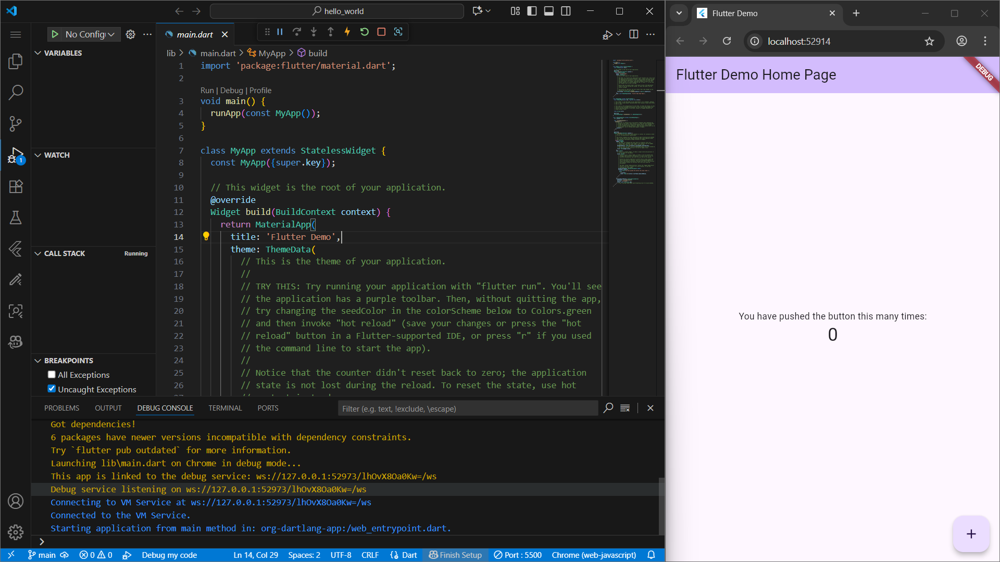

### Practical 4

This lab guides you through implementing two of the most fundamental widgets in Flutter: Text and Image. Here’s a clear breakdown of each step.

### Step 1: Using the Text Widget ✍️
This step teaches you how to create and style text.

1. Create the Widget File:

- Inside the lib folder of your project, create a new folder named basic_widgets.

- Inside this new basic_widgets folder, create a file named text_widget.dart.

2. Add the Code:

- Open text_widget.dart and add the following code. This creates a reusable widget called MyTextWidget.
- 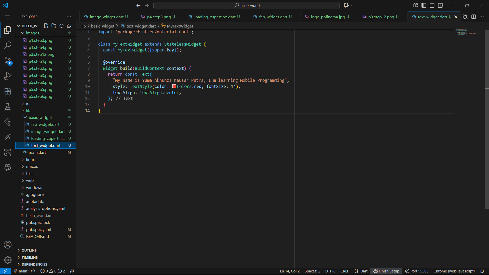
- 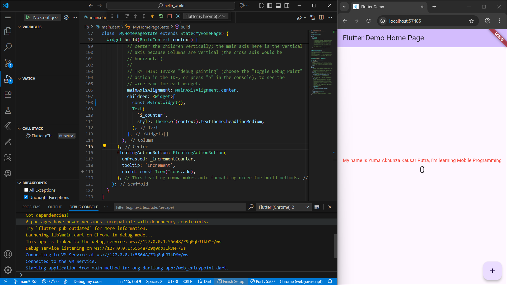

### Step 2: Image WIdget

1. Create a file image_widget.dartin the basic_widgets folder with the following code.
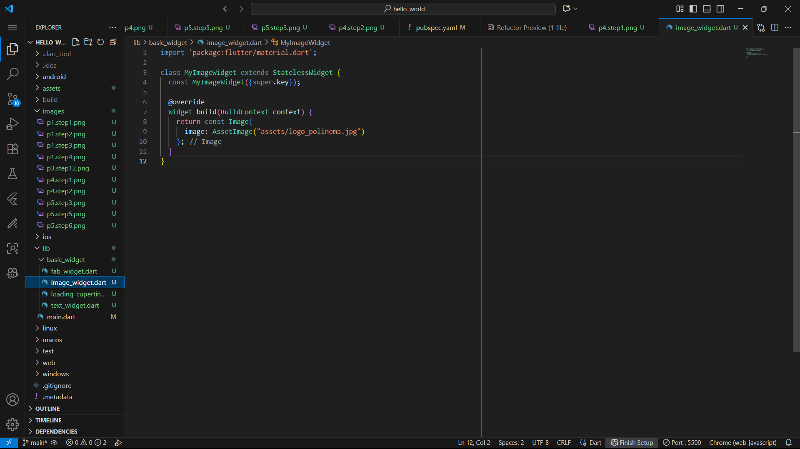

2. Make asset adjustments to the file pubspec.yamland add your logo file in the assetshello_world project folder.
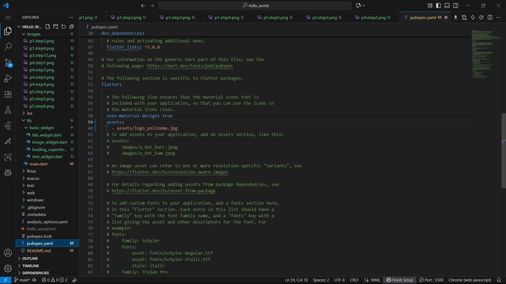
3. Don't forget to adjust the code and import it in the file, main.dartthen the image will appear as follows.
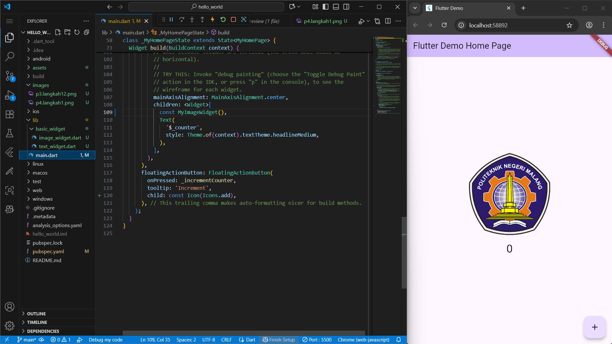

## Practical 5: Implementing Material Design Widgets and iOS Cupertino

### Step 1: Cupertino Button and Loading Bar

Create a file in basic_widgets > loading_cupertino.dart. Import the stateless widget from Material and Cupertino. Then, enter the following code in the Widget build method.

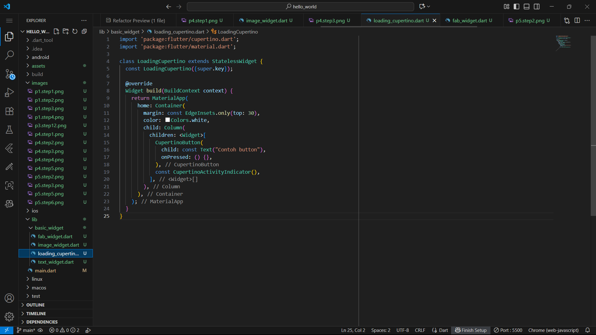

### Step 2: Floating Action Button (FAB)
There are several types of button widgets in Flutter, namely ButtonBar, DropdownButton, TextButton, FloatingActionButton, IconButton, OutlineButton, PopupMenuButton, and ElevatedButton.

Create a file in basic_widgets > fab_widget.dart. Import the stateless widget from material. Then, enter the following code in the Widget build method.

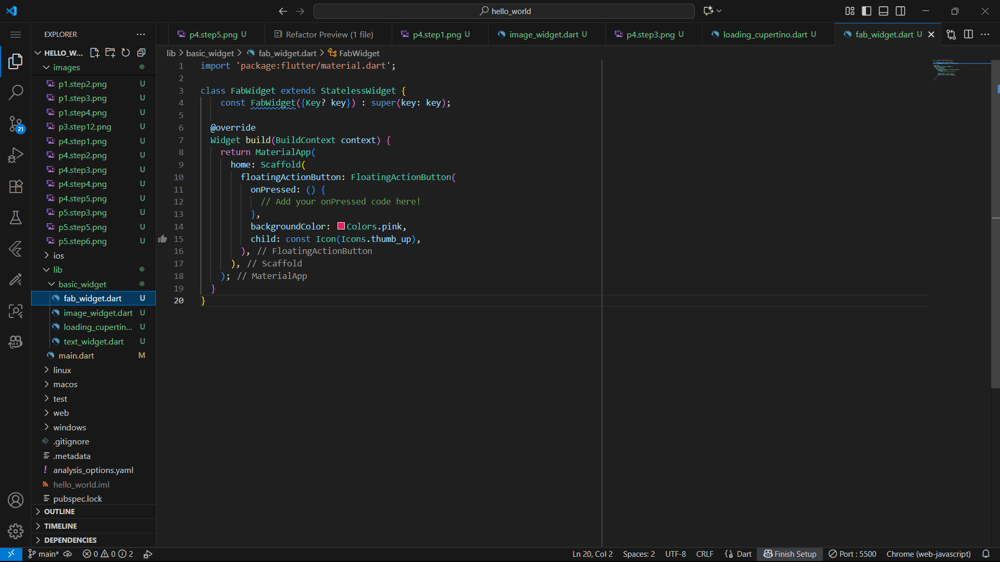

### Step 3: Scaffold Widget
Scaffold widget is used to arrange the layout according to material design.

Change the code content main.dart follows.

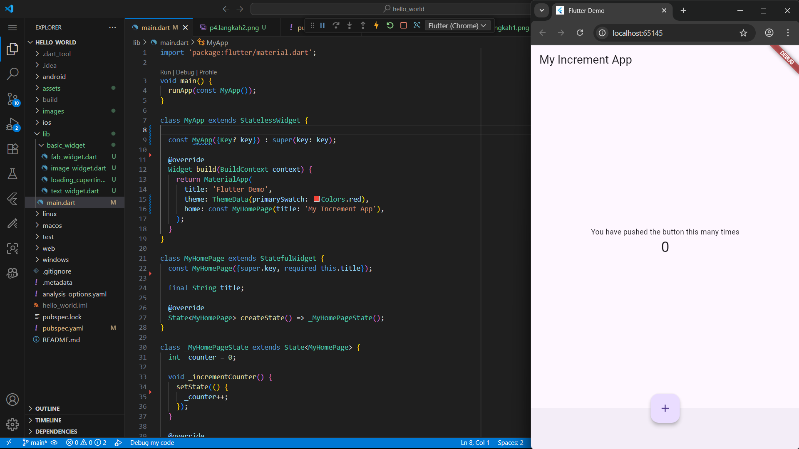

### Step 4: Widget Dialog
The widget dialog in Flutter has two types of dialogs, namely AlertDialogand SimpleDialog.

Change the code content main.dartas follows.

### Step 5: Input and Selection Widget
Flutter provides widgets that can receive input from application users, including Checkboxes, Date and Time Pickers, Radio Buttons, Sliders, Switches, TextFields.

An example of using the TextField widget is as follows:

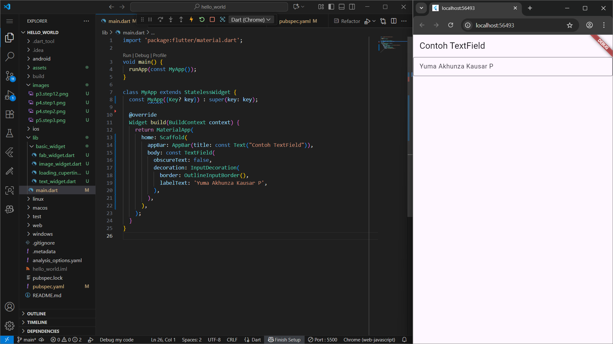

### Step 6: Date and Time Pickers
Date and Time Pickers are included in the input and selection widget category, here is an example of using Date and Time Pickers.

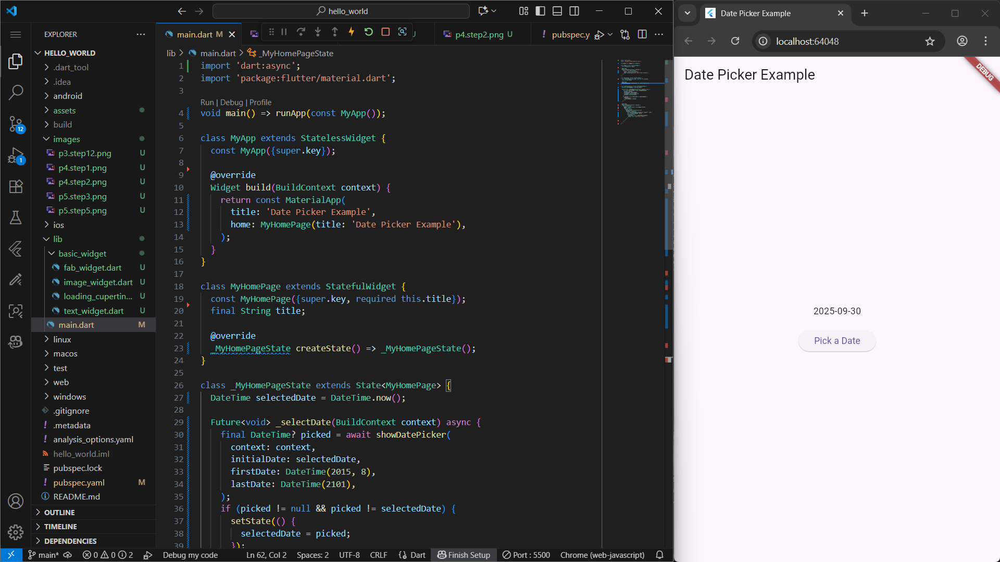

Practical Assignments
1. Complete Practicals 1 to 5, then document and push them to your repository in the form of screenshots of each work result along with an explanation in the file README.md!

2. Complete Lab 2, and you'll be required to run the hello_world app on a physical device (Android/iOS) to gain experience connecting to a physical device. Capture the results of the app on the device, then create a lab report in a README.md.

3. In practical 5, starting from Steps 3 to 6, create a separate widget file in the folder basic_widgets, then in the file main.dart, simply import the widget according to each step!

4. Complete Codelabs: Your first Flutter app , then create a lab report and push it to your GitHub repository!

5.README.mdContains: capture the final results of each practicum ( side-by-side , can also be in the form of a GIF file to show the change process when there is an action from the user) by displaying your Student ID and Name as a characteristic of your work.

6. Submit your GitHub repository/commit link to the agreed lecturer!

ANSWER

Answers for numbers 1, 2, 3, 4, 5, and 6. I have completed all the practical reports in the report above, so I have done the practical assignment above.